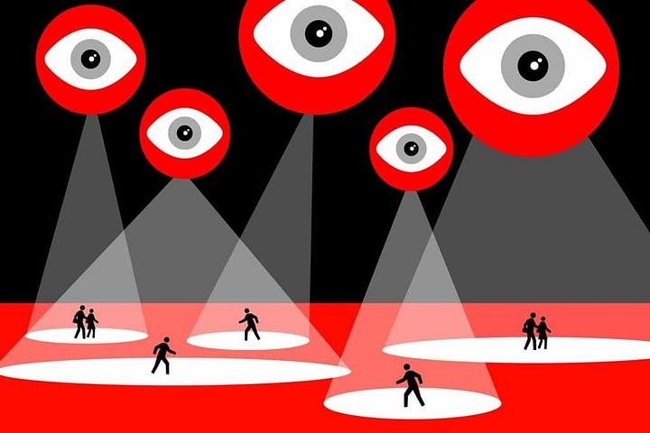
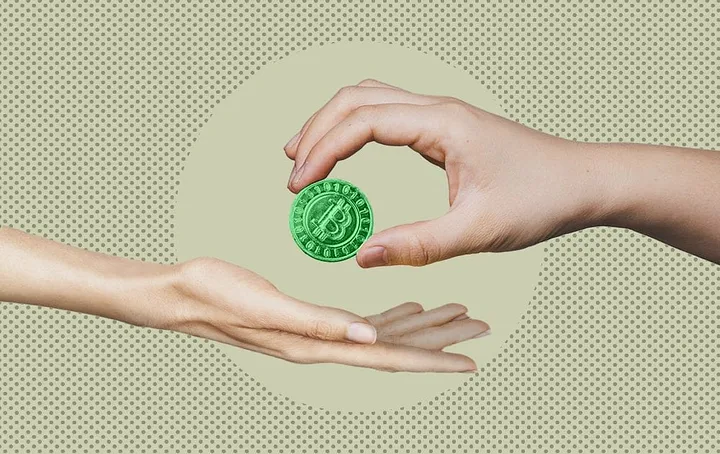
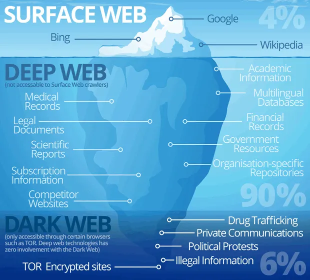

```
Traduzido por: mem3tic@mut8ion
Revisado por: 
```
[```ver lista de contribuidores```](/about/#contribuidores)

# Cypherpunks 101

## Privacidade Importa: Cypherpunks, Cripto-Anarquistas e Seus Inimigos

Os termos "cypherpunk" e "cripto-anarquismo" não aparecem muito na mídia. Nos últimos anos, Edward Snowden e Julian Assange ajudar
am a popularizar esses termos até um certo grau, mas ainda não está claro para a maioria o que esses termos significam. Conhecer e
sses movimentos agora tem se tornado inegociável para aumentar a consciência acerca dos primeiros sinais do nascimento dos aparatos
 distópicos de vigilância.

Os movimentos Cypherpunk e Cripto-Anarquista têm sido ferozes ativistas da Privacidade e Liberdade desde os anos 1980, e previram 
exatamente o que nossa sociedade se tornaria, caso a pulverização da tecnologia não fosse acompanhada de tecnologias que melhoram 
a privacidade e regulações. Quarenta anos depois, nos encontramos num mundo no qual corporações e governos podem acessar nossas in
formações pessoais sem que nós sequer saibamos. A mesma tecnologia, que tinha como objetivo nos dar maiores habilidades de livre a
ssociação e liberdade de expressão, está se transformando numa jaula.

### Cypherpunks & Cripto-Anarquistas: Quem são eles?

O movimento Cypherpunk nasceu no final dos anos 80 e foi criado por Eric Hughes, Timothy C. May, e John Gilmore. Inaugurado pelo Manifesto Cripto-Anarquista, de Timothy May, o movimento Cypherpunk foca nas questões de privacidade na rede aberta, definindo privacidade como: "o poder de revelar seletivamente a si mesmo para o mundo" (Hughes, ed. Ludlaw, 2001, p. 81). Seu principal objetivo é prevenir a revelação de informações desnecessárias comumente requeridas em transações. Como Hughes escreve:


>"Nós, os Cypherpunks, nos dedicamos a construir sistemas anônimos. Nós estamos defendendo nossa privacidade com criptografia, com encaminhadores anônimos de emails, com assinaturas digitais, e com dinheiro eletrônico. Cypherpunks escrevem código. Nós sabemos que alguém há de escrever programas para defender a nossa privacidade e, como sabemos que ninguém terá privacidade até que todos a tenhamos, nós mesmos os escreveremos. Nós tornamos públicos nossos códigos para que nossos colegas Cypherpunks possam brincar com eles e utilizá-los na prática [...]. Cypherpunks deploram regulações sobre criptografia, pois encriptar é fundamentalmente um ato privado. O ato de encriptar, de fato, remove informações do domínio público. Mesmo as leis contra criptografia alcançam tão somente as fronteiras de uma nação e o braço de sua violência. Criptografia inevitavelmente se espalhará por todo o globo e, com ela, todos os sistemas de transações anônimas que através dela se fazem possíveis." (May, ed. Ludlaw, 2001, p. 83).


*Fonte: [Bitcoin Magazine](https://bitcoinmagazine.com/culture/crypto-art-of-resistance-remember-remember-the-legacy-of-the-cypherpunks)*

Cypherpunks têm lutado diversas batalhas contra o governo dos EUA, particularmente através de ações judiciais contra ele, por suas tentativas de limitar a criptografia, e também ao incitar a agitação civil. Enquanto muitas de suas conquistas continuaram a ser dificultadas pelo governo, algumas delas, como MintChip, a carteira eletrônica canadense, e o Bitcoin, não puderam ser reprimidas - e não só continuam existindo - mas sim prosperando.

Cripto-Anarquismo é outro movimento importante desenvolvido pelos primeiros Cypherpunks. Enquanto retém os mesmos princípios do movimento Cypherpunk, o movimento Cripto-Anarquista se enquadra como um movimento político mais abrangente. Como o nome sugere, o movimento Cripto-Anarquista se propõe a superar o alcance do modelo tradicional de nações-Estados através da fundação de uma sociedade baseada na livre associação, cooperação, igualitarismo, libertarianismo econômico e descentralização.

Segundo o Cripto-Anarquismo, métodos criptográficos vão alterar a natureza das corporações e da interferência governamental em transações econômicas e sociais. Como May coloca: "Combinada com mercados emergentes de informação, a Cripto-Anarquia vai criar um mercado líquido para todo e qualquer material que possa ser colocado na forma de palavras e imagens" (May, ed. Ludlaw, 2001).

Cripto-Anarquistas não só estão comprometidos com criar programas que podem proteger contra os abusos do Estado: Eles também lutam para construir novas estruturas socioeconômicas através de código. Neste contexto, é possível entender como ideias e valores cripto-anarquistas estão refletidos na arquitetura da tecnologia _Blockchain_. _Blockchain_ permite que um coletivo de pessoas possa formular, disseminar, manter e verificar um sistema institucional enquanto registram as interações dentro da mesma (MacDonald, Allen and Potts, 2016). Isso nos permite mudar os meios pelos quais governamos a nós mesmos enquanto coletivos, e provém as bases parauma sociedade não-coercitiva baseada em concenso.

### Vigilância, Dinheiro e o Estado

Hoje, nós somos forçados a conviver com instituições político-econômicas caras e exclusivas: Elas têm alto potencial para erro e invadem a privacidade pessoal dos usuários sem qualquer supervisão ou responsabilidade. De diversas formas, tais instituições são as principais interessadas num mundo distópico de opressão, no qual a tecnologia é controlada exclusivamente pelo Estado e Grandes Corporações. Por enquanto, a parte mais problemática ainda é que não estamos completamente cientes do fato de que a vigilância em massa tem se tornado cada vez mais barata, invisível e penetrante. O argumento mais popular que aparece quando alguém ouve falar sobre a perda de privacidade é: "Mas eu não tenho nada a esconder, então não devo me importar". Entretanto, privacidade não se trata de esconder o errado, mas sim sobre ter controle sobre sua própria comunicação. Na lógica do "nada a esconder", a escolha se resume a uma aceitação passiva da vigilância em massa, ao invés de uma defesa ativa de seus próprios direitos.



Empresas como Facebook, Google e Amazon têm tido sucesso em tornar a vida online de seus usuários mais confortável ao permitir que comprem coisas em poucos minutos, que recebam informações relevantes baseadas no histórico recente de navegação na internet, e que identificam automaticamente o rosto de seus amigos numa foto. O lado ruim de tal "conveniência" é que Grandes Corporações e Agências Governamentais abusam e muitas vezes usam indevidamente os dados privados de usuários para retornos pessoais (veja Shoshana Zuboff, "A Era do Capitalismo de Viligância" - "The Age of Surveillance Capitalism").

>"Privacidade é necessária para uma sociedade aberta na era eletrônica. Privacidade não é segredo. Um assunto privado é algo que não se quer que o mundo inteiro saiba, enquanto um assunto secreto é algo que não se quer que absolutamente ninguém saiba. *Privacidade é o poder de se revelar seletivamente ao mundo*."

Embora a tecnologia tenha, sem dúvida, se tornado um grande trunfo para aumentar nossa eficiência, não podemos ignorar o fato de que as assimetrias de poder que resultam do atual estado de coisas aumentam a vulnerabilidade dos usuários. Assim, o objetivo é encontrar uma maneira ideal de implantar a tecnologia para atender aos melhores interesses dos usuários, além de garantir a integridade do processo do início ao fim.

## Criptografia como um Meio para restabelecer a Privacidade e Autonomia

### Criptografia e o Sistema Financeiro

O Cripto-Anarquismo é um movimento que usa Criptografia para permitir que os usuários existam on-line de forma anônima. Ele se esforça para libertari os dados privados da vigilância institucional. “Criptografia” é o método de armazenar e transmitir dados de uma forma particular, para que apenas aqueles a quem se destina possam lê-los e processá-los. Embora a Criptografia possa ser altamente benéfica para usuários individuais, muitas vezes é interpretada como uma *ameaça* para governos e agências relacionadas, que têm interesse em monitorar as comunicações e as transações econômicas.


Em sua raiz, a proposta de valor da criptografia está intimamente relacionada com a estrutura do sistema financeiro moderno e a relação entre governos e prestadores de serviços financeiros. Embora esta relação tenha evoluído ao longo do tempo, a crise financeira de 2007-2008 ilustrou a excessiva confiança na eficiência dos mercados existentes por uma série de instituições centralizadas e “muito-grandes-para-falir”. No contexto da crise, os grandes bancos emprestaram enormes volumes de dinheiro uns aos outros, enquanto os cidadãos médios permaneceram à mercê dessas instituições para o acesso e manuseio dos fundos e o valor das transações. Como resultado deste sistema, muitos países continuam a experimentar as consequências - há 14 anos e contando - do *fracasso da política monetária*.

Austeridade, enormes dívidas, aumento do desemprego e instabilidade política no geral levantam a seguinte questão: o que podemos aprender sobre o papel do Estado com isso? Para salvar a economia do fracasso, governos em todo o mundo têm injetado bilhões de dólares no sistema financeiro para resgatar os bancos nacionais. Esta política fiscal expansiva não oferece uma solução de longo prazo para a política fiscal fundamentalmente degradada dos Bancos Centrais. Isso não quer dizer que as intervenções do governo foram completamente inúteis, mas sim que nossa realidade (econômica) hoje é muito complexa para ser controlada apenas pelo dinheiro.

O Cripto-Anarquismo destaca as fraquezas das economias atuais quando se trata de amortecer os choques e a incapacidade dos Estados de encontrar soluções eficazes e sustentáveis. O Cripto-Anarquismo procura construir uma realidade alternativa, na qual os cidadãos possam redefinir suas interações econômicas, lutar em direção à igualdade social e potencialmente alcançar uma maior agência.

### Tornando Real a Rede Aberta (Open Web) para uma Sociedade mais Livre


Durante anos, Cypherpunks e Cripto-Anarquistas nos alertaram sobre os perigos de um aparelho estatal abertamente centralizado. Eles se opuseram ao status quo, desenvolvendo os meios tecnológicos para escapar da vigilância e se engajaram em resistência aberta à opressão estatal. Seu trabalho tem sido impactante, enquanto, no entanto, o capitalismo de vigilância continua a prosperar às custas da liberdade e da agência das pessoas. Neste contexto, a adoção de uma tecnologia que impeça os gigantes da tecnologia e o Estado de deterem uma quantidade desproporcional de poder e informação sobre as pessoas torna-se crucial para salvaguardar as liberdades fundamentais, os direitos e a dignidade humana.

A Rede Aberta (Open Web), e sua principal tecnologia subjacente, têm a capacidade de fundamentar um caminho para uma sociedade na qual a privacidade, a liberdade e a transparência são fornecidas aos seus cidadãos. É, portanto, crucial que o seu desenvolvimento seja seguido e encorajado.

No entanto, o desenvolvimento de tecnologias que melhoram a privacidade devem andar de mãos dadas com a conscientização sobre a importância da privacidade. As implicações do acesso corporativo e governamental aos dados pessoais ainda não são totalmente compreendidas, já que a narrativa dominante em torno da privacidade diminui a importância do controle do usuário sobre suas próprias informações.

A luta pela privacidade e pela liberdade não é apenas travada a nível tecnológico, mas também a nível intelectual. O combate às narrativas tradicionais que retratam a privacidade como um perigo para a sociedade, precisa ser resistida e desmantelada com a ajuda da lógica e do senso comum. Se a tecnologia nos permitir criar novas possibilidades, são apenas as palavras e a razão que nos permitirão usá-las para fins humanos e de reforço da liberdade.

## Mitos e Equívocos Comuns Sobre os Cypherpunks

### Mito 1: Criptomoeda É Apenas Mais Uma Moeda



Uma das principais vantagens competitivas da _blockchain_ em relação ao Estado é a alta segurança. Historicamente, as instituições desenvolveram diferentes formas de registrar transações de todos os tipos. O objetivo sempre foi criar um sistema que fosse *resiliente* ao roubo de informações, corrupção e manipulação. Hoje, *o nexo de poder tornou-se irremediavelmente corrupto* e, portanto, o Estado falha nessas premissas. Sabemos disso por causa da criação de perfis digitais ou imagens detalhadas de cada indivíduo com base na atividade online. Todas as Grandes Corporações estão seguindo o comportamento do consumidor porque podem extrair um enorme valor disso. As criptomoedas, como um sistema digital _peer-to-peer_ (ponta-a-ponta) descentralizado para a troca de valor, oferecem um modelo alternativo aos instrumentos financeiros atuais de última geração, nos quais as informações financeiras são controladas e rastreadas pelas instituições do Estado e relacionadas.

Criptomoedas, portanto, são mais do que simplesmente outra moeda. Em virtude de serem baseados em ledgers (livros razão) públicos distribuídos, eles fornecem uma base para criar novas maneiras de lidar com dados financeiros, fora do alcance dos capitalistas de vigilância. Esta é exatamente a razão pela qual as criptomoedas foram tão bem recebidas na comunidade cripto-anarquista e além. De uma perspectiva Cripto-Anarquista, várias aplicações blockchain têm o potencial de permitir uma organização econômica auto-sustentável. Além do controle sobre os dados, as criptomoedas oferecem outro modelo econômico anti-inflacionário, mais eficaz. O Bitcoin, por exemplo, cresce organicamente devido ao número limitado de moedas e, portanto, contorna a inflação. Outras criptomoedas, por sua vez, foram projetadas para serem privadas, anônimas e rápidas, tornando-as populares nos mercados da Dark Web.

### Mito 2: A Dark Web é para Tráfico Humano e Exploração de Drogas

>A dark web é o coletivo oculto de sites na Internet que são acessíveis apenas por um navegador especializado. É usado para manter a atividade na Internet anônima e privada, o que pode ser útil em aplicações legais e ilegais. Enquanto alguns o usam para evitar a censura do governo, também é conhecido por ser utilizado para atividades altamente ilegais. ("O que é a Dark Web Profunda" - "What Is The Deep Dark Web" , 2020)

Quando o termo “Dark Web” vem à tona, há uma tendência de assumir que apenas criminosos gostariam de usá-la. Ao contrário dos vários estereótipos e preconceitos, a Deep Web é em grande parte composta de conteúdo seguro, como bancos de dados públicos e privados e intranets que usamos todos os dias. A face do crime, sem dúvida, mudou com o nascimento de navegadores anônimos como o Tor, mas como os Cripto-Anarquistas enfatizam, há um lado benéfico para a internet oculta. Por exemplo, a Deep Web pode ser vista como uma área comercial nova e mais democrática. Imagine que não era apenas um lugar para contornar as restrições geográficas locais e assistir a uma TV local, mas um lugar onde se pode comprar medicamentos de outra forma inacessíveis para tratar pacientes com câncer? Pode se tornar mais um lugar equivalente ao eBay?



Tornando real o sonho Cripto-Anarquista, as características da Deep Web representam com precisão valores como retenção, reciprocidade e integridade. A ausência de indexação de páginas da Web e segurança de rede, como a criptografia, protege os usuários do Google e de outras entidades que acessam seus dados. Por conseguinte, os mercados anônimos não devem existir apenas para as drogas, mas também para os alimentos, medicamentos e muito mais. Os preços no mercado negro têm a capacidade de tornar os produtos mais acessíveis. “Mais importante, qualquer entendimento da ‘Dark Web’ deve estar ciente do contexto atual de vigilância e desrespeitado pela privacidade que grande parte do mundo vive até hoje. É, portanto, altamente atraente para rejuvenescer o conceito da Deep Web do ângulo Cripto-Anarquista e explorar sua potencial usabilidade para melhorar a privacidade dos dados e construir um sistema econômico alternativo: podemos considerar a Dark Web como um meio pelo qual os usuários podem lutar contra o totalitarismo.

#### Recursos Úteis

[Security Without Identification: Card Computers to Make Big Brother Obsolete](https://chaum.com/security-without-identification/) (1985)

[Crytography’s Role in Securing the Information Society,](https://nap.nationalacademies.org/catalog/5131/cryptographys-role-in-securing-the-information-society) edited by Kenneth W. Dam and Herbert S. Lin (1996)

A seminal work in the field, Diffie and Hellman’s [“New Directions in Cryptography”](https://ee.stanford.edu/~hellman/publications/24.pdf) (1976)

[Cypherpunks: Freedom and the Future of the Internet,](https://resistir.info/varios/assange_livro_port.pdf) Julian Assange (2012)

[“Battle of the Clipper Chip”](https://www.nytimes.com/1994/06/12/magazine/battle-of-the-clipper-chip.html) in The New York Times (1994)

[The Evolution of US Government Restrictions on Using and Exporting Encryption Technologies](http://www.foia.cia.gov/sites/default/files/DOC_0006231614.pdf) (FOIA: 2010)
---
Fonte: 
* https://cypherpunkguild.medium.com/cypherpunks-101-ep-1-82d91f13aa2

* https://cypherpunkguild.medium.com/cypherpunks-101-ep-2-314bf6f054a2

* https://cypherpunkguild.medium.com/cypherpunks-101-ep-3-common-myths-and-misconceptions-about-cypherpunks-260b2f5f72eb
