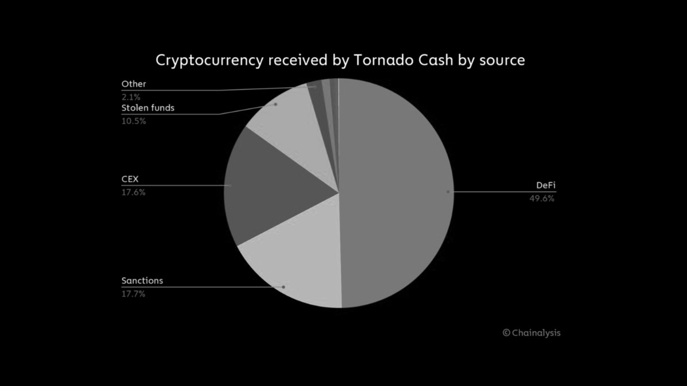
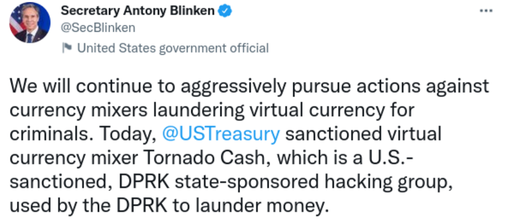
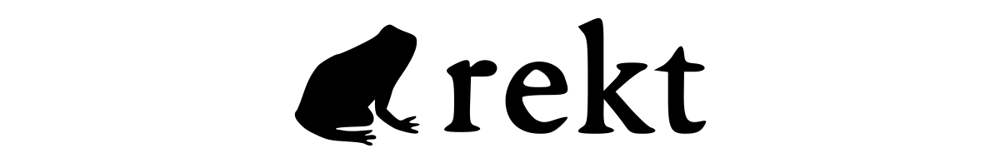

```
Traduzido por: Vinicius Yaunner
Revisado por: peixe lua
```

[```ver lista de contribuidores```](/about/#contribuidores)

# O olho da tempestade


===exibe no card daqui pra baixo===

**"Se você não tem nada a esconder, você não tem nada a temer."**

*Mas quando não há onde se esconder, você deve ter muito medo.*

A repressão começou e, embora tenha a atenção de todos, não causou muita surpresa.

O Tornado Cash, o mais controverso dos aplicativos Ethereum, vive com tempo emprestado. E parece que [tentativas recentes](https://twitter.com/TornadoCash/status/1514904975037669386) de aplacar as autoridades não foram suficientes para mantê-las afastadas por muito tempo.

Com mais de [$1 bilhão de TVL](https://twitter.com/TornadoCash/status/1514904975037669386) em seu pico, o notório mixer tem sido a melhor escolha para lavar [fundos roubados](https://rekt.news/leaderboard/). E [embora saibamos](https://www.elliptic.co/blog/540-million-stolen-from-the-ronin-defi-bridge) que a Coreia do Norte, com seu histórico indefensável de direitos humanos, está entre aqueles que se beneficiam do anonimato fornecido pelo Tornado, ainda lutamos pelo nosso direito de usá-lo.

*Se não sanções, então qual é a solução? Se permitirmos privacidade, existem exceções?*


**Ontem, o Tornado Cash e alguns de seus endereços de contratos inteligentes foram [adicionados](https://home.treasury.gov/policy-issues/financial-sanctions/recent-actions/20220808) à [lista OFAC](https://www.treasury.gov/ofac/downloads/sdnlist.pdf) do Tesouro dos EUA de Nacionais Especialmente Designados (SDNs) e Pessoas Bloqueadas.**

Essa sanção torna ilegal que qualquer cidadão, residente ou empresa dos EUA interaja com os endereços sancionados, que atualmente [contêm US$ 437 milhões](https://twitter.com/BowTiedIguana/status/1556683136280408064) em ETH, WBTC e stablecoins.

Qualquer interação com os endereços [seria considerada](https://www.youtube.com/watch?v=XpTrCA3tEKM&t=172s) um ato criminoso sob [responsabilidade objetiva](https://en.wikipedia.org/wiki/Strict_liability), o que significa que um promotor não precisa provar a intenção, ou mesmo o conhecimento das sanções, para que um usuário seja culpado.

O Tesouro [define](https://twitter.com/BowTiedIguana/status/1556683136280408064) seus *“Nacionais Especialmente Designados” como: “uma lista de indivíduos e empresas pertencentes ou controladas por, ou agindo para ou em nome de países-alvo. Também lista indivíduos, grupos e entidades, como terroristas e narcotraficantes designados em programas que não são específicos de cada país”.*

Como essa definição deixa claro, o Tesouro está usando o Tornado Cash como um alvo de proxy para qualquer organização ou indivíduo que se encaixe na descrição do OFAC e criminaliza qualquer usuário que busque privacidade por razões perfeitamente legítimas no processo.

E como mostra o [gráfico](https://home.treasury.gov/policy-issues/financial-sanctions/specially-designated-nationals-and-blocked-persons-list-sdn-human-readable-lists) a seguir, menos de 30% dos recursos depositados no protocolo vêm de fontes ilícitas.



**Esta é a primeira vez na história que um pedaço de código foi sancionado como se fosse uma pessoa ou uma organização.**

Ao apontar o dedo para *inimigos publicamente aceitáveis*, como terroristas e barões da droga, muitos no mainstream podem ver isso como uma vitória contra a ilegalidade online.

Em uma época em que atores malignos patrocinados pelo Estado não estão mais se escondendo nas sombras, é fácil para os reguladores reprimir ferramentas como o Tornado.

Mas parece que aqueles que dão as ordens não entendem o que estão proibindo. O secretário de Estado dos EUA, Blinken, [confundiu](https://twitter.com/LefterisJP/status/1556679380272877568) ontem o Tornado Cash com o próprio Grupo Lazarus:



**Essas são as pessoas que fazem as leis pelas quais muitos de nós devemos viver: incapazes (ou relutantes) de diferenciar pessoas e ferramentas, atores maliciosos de infraestrutura neutra.**

*Mas, embora sejam fáceis de zombar, essas justificativas para banir uma ferramenta neutra prejudicam a privacidade dos usuários regulares.*

Em um sistema transparente, quem deseja quebrar a trilha entre os endereços tem duas opções, mixers não custodiais e [CEXs](https://coinmarketcap.com/alexandria/glossary/centralized-exchange-cex). E como vimos recentemente, confiar sua criptomoeda a um CEX está longe de ser uma alternativa sem riscos.

**Existem [muitas razões legítimas](https://twitter.com/RezaJafery/status/1556751888896258049) para usar um serviço como o Tornado Cash, mas, em última análise, a privacidade é um direito humano, e isso não deveria ser suficiente?**


**O anúncio traz muitas questões anteriormente teóricas para o centro do palco.**

*Todos os endereços que já interagiram com os contratos serão afetados? O TVL de US$ 437 milhões está efetivamente preso nos contratos? Aqueles que doaram via GitCoin agora são criminosos?*

**O descuido com que o OFAC executou a sanção deixou muito a ser esclarecido.**

Os endereços afetados foram copiados cegamente das [tags Etherscan](https://etherscan.io/accounts/label/tornado-cash), incluindo seu endereço de doação GitCoin, e incluem apenas os contratos da rede principal, apesar do Tornado Cash estar ativo no BSC, Arbitrum e Optimism.

O que acontecerá com os endereços ([mais de 400](https://dune.com/lewi/salted-eth) e contando) contaminados por fundos dos contratos proibidos? Os endereços doxxed verão suas contas ['salgadas'](https://etherscan.io/address/0x12d66f87a04a9e220743712ce6d9bb1b5616b8fc#internaltx) ou campanhas de extorsão surgirão daqueles com fundos 'sujos'?

E isso vai parar em endereços individuais? E quanto à *pools* inteiras? Protocolos? Eles também podem ser contaminados com todas as interações subsequentes marcadas com o mesmo pincel?

Os impactos da sanção foram sentidos imediatamente, pois o GitHub, de [propriedade da Microsoft](https://techcrunch.com/2018/06/04/microsoft-has-acquired-github-for-7-5b-in-microsoft-stock/), baniu rapidamente todo o [repositório](https://github.com/tornadocash) Tornado Cash e [excluiu contas](https://twitter.com/semenov_roman_/status/1556717890308653059) de seus contribuidores, e até o GitCoin [suspendeu](https://twitter.com/gitcoin/status/1556710551803281410) a concessão do projeto.
Escolha privacidade enquanto ainda é uma opção.
Foi menos surpreendente ver que a Circle foi rápida em entrar na linha, [congelando](https://twitter.com/bantg/status/1556712790894706688) os ~ $75k USDC que estavam nos contratos da Tornado, além dos $150 doados via GitCoin, apesar de ter [prometido anteriormente](https://twitter.com/jerallaire/status/1542525419118657537) “lutar legalmente” contra a lista negra geral.

*Tememos o CBDC, mas talvez já esteja aqui…*

Quanto tempo até que a Circle de repente decida que cada endereço deve ter [KYC](https://en.wikipedia.org/wiki/Know_your_customer) antes de mover seus fundos?


**A ordem estabelecida se comporta de modo a se proteger; ela deve destruir os sistemas que não compreende.**

Se queremos ficar à frente dos governos que estão correndo para proteger seus interesses, devemos agora agir para fortalecer os pontos fracos em nosso próprio sistema.

**As ações de stablecoins centralizadas sob pressão governamental podem causar danos sem precedentes às finanças “descentralizadas”.**

Uma stablecoin descentralizada segura e um sistema anônimo seguro são as soluções óbvias para as ameaças que estamos enfrentando.

No entanto, embora seja fácil ficar indignado com esse ataque ao anonimato, seria ingênuo pensar que podemos continuar a [codificar nosso caminho em torno das regras da sociedade](https://twitter.com/davidgerard/status/1556740122934116354).

É claro que a criminalidade está presente nas criptomoedas, mas isso significa que, pela lógica do OFAC, também devemos proibir a internet e até mesmo o próprio dinheiro?

Como uma comunidade, a criptomoeda deve priorizar a privacidade em vez de simplesmente lucrar, ou perder qualquer esperança de se tornar uma ferramenta para autonomia financeira e, em vez disso, se transformar na maior ferramenta de vigilância já criada.

A exclusão de um sistema projetado para difamar, vigiar e controlar aqueles que ousam sair da linha não deve ser considerado crime por padrão.

**Escolha privacidade enquanto ainda é uma opção.**

**[Está na hora de ir para a escuridão...](https://twitter.com/RektHQ/status/1555584960081321984)**



---

Fonte: [The Eye of the Storm](https://rekt.news/eye-of-the-storm/)
