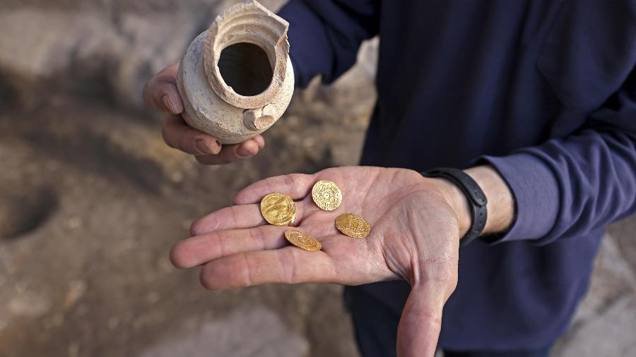
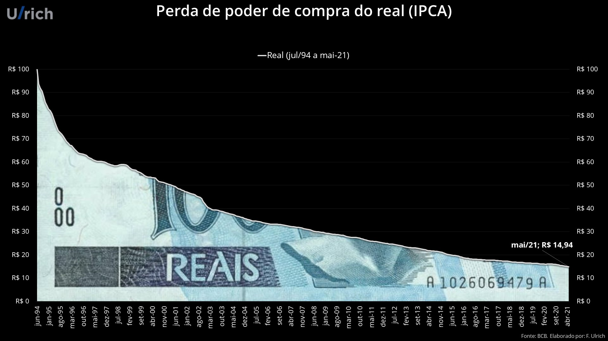
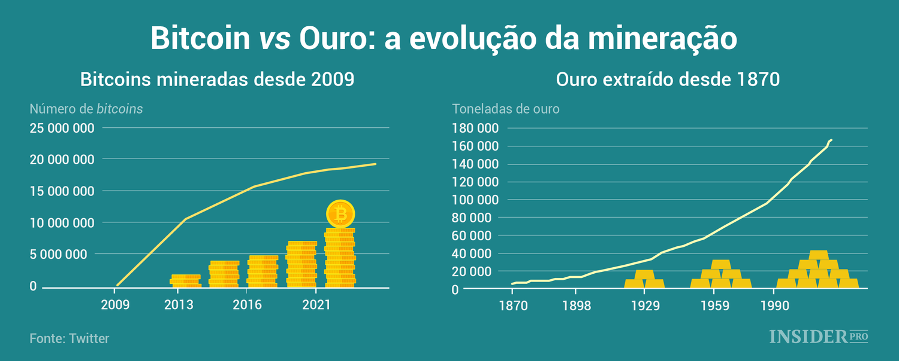
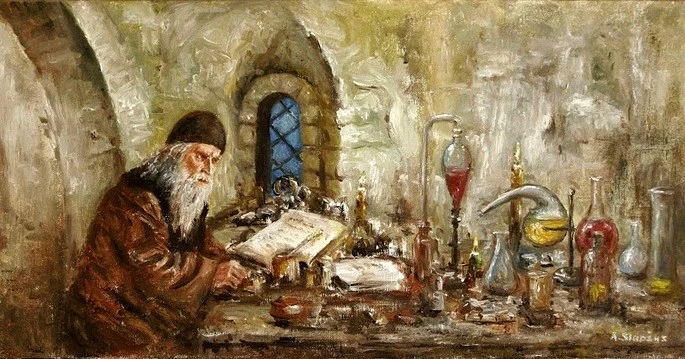

```
Revisado por: Cypherpunks Brasil
```
[```ver lista de contribuidores```](/about/#contribuidores)

# Respeite seu trabalho, compre ouro



## Introdução

O ouro é um metal precioso, usado há muito tempo, como em decorações, reserva de valor, símbolo de poder, contextos religiosos (espirituais) e principalmente como moeda nas trocas dos indivíduos. Sua pureza é representada pela letra “k” (quilates). É um ativo com oferta limitada (escasso) que a maioria do mundo conhece.

Diversas [formas de ouro](https://www.comproourobh.com.br/quais-os-tipos-de-ouro-conheca-os-principais) existem, 24k (100% ou 99% de pureza), 18k (75% de pureza) e outros com menor quantidade de ouro puro, quando o metal não é puro, ele é coberto por outras ligas metálicas geralmente menos valiosas e mais resistentes. No mercado das joalherias é geralmente usado o ouro de 18k, pois, o de 24k seria muito mais fácil da joia sofrer algum tipo de dano, como amassados.

Existem outros tipos de ouro que provavelmente você já ouviu falar, como o rosa e o branco, eles são resultados de misturas com outros metais (vale a sua pesquisa). A valorização do ouro é surreal, desde 1900 até hoje (2023), o metal aumentou seu valor em 90 vezes, antes uma [onça de ouro](https://www.infopedia.pt/apoio/artigos/$onca-(oz)) custava US$ 20 (20 dólares), no momento atual está em US$ 1.800 (1.800 dólares), o apresentador e empresário Silvio Santos já falava: “Ouro vale mais que dinheiro”, ele estava certo!

## Padrão-ouro

Acredito que você já ouviu falar sobre a época do padrão-ouro, ela teve seu fim na [década de 10](https://www.suno.com.br/artigos/padrao-ouro), com o aumento do poder dos governos sobre a moeda e a centralização da economia, foi criado uma demanda por moedas de mais fácil controle. As gerações que viveram nesse momento, trocavam não só ouro por mercadorias, mas também, prata, cobre, bronze e outros metais. Com o passar do tempo, governos começaram a atrelar o valor das suas moedas a quantidade de reserva de ouro que tinham.

Desde a década de 70, o [dólar não tem mais lastro](https://www.infomoney.com.br/colunistas/blog-do-cunha/o-lastro-do-dolar-e-maior-do-que-o-do-bitcoin) em ouro. Não acredito em um sistema baseado em metais que esteja atrelado a entidades centralizadoras, tende a falha, porém, hoje é muito pior, já que um cambio fixo no ouro é melhor que um flutuante no papel. Precisamos acabar com essas instituições de regulação estatal e deixar a economia seguir o seu caminho, assim podemos ter um sistema saudável, voluntário e natural, quem sabe com a volta dos metais como moedas de troca.

Para uma moeda ser segura, ela tem que estar atrelada a algo de valor, como o ouro é, e como o Bitcoin trabalha (minerando através da troca de esforço computacional), já o dólar e outras moedas fiduciárias, temos apenas papel e alguns requisitos de segurança que podem ser burlados por bons falsificadores, nada mais que isso.

Quem é beneficiado nas transações dessas péssimas moedas não é você, são grandes bancos e o estado, pois, eles têm total liberdade para fazer malabarismos econômicos, por exemplo, expandir a base monetária para vender populismo barato, o resultado disso já sabemos, os preços irão subir e o mais pobre pagará bem caro, sem entender o que esta acontecendo, às vezes até reclamando dos altos preços no mercado e culpando os comerciantes locais, mas o real culpado está andando de iate ou jatinho as suas custas e rindo da sua cara. Infelizmente vivemos o capitalismo de estado no Brasil, onde mandam os poderosos do dinheiro e da política, onde fazem corporativismo e lóbi, estamos longe do [*laissez-faire*](https://www.significados.com.br/laissez-faire). Uma coisa é certa, nada foi tão estável como o padrão-ouro até o momento.

## Ouro vs Bitcoin

Com a crescente ideia de termos moedas em formatos digitais pelo avanço da tecnologia e adesão da população a transferências bancárias como Pix, TED e outras, muitas pessoas estão se distanciando de moedas físicas, nos tempos atuais já estamos falando até do Real em forma digital, isso é muito assustador, pois, o governo brasileiro terá mais controle ainda da moeda. Devido à crescente adoção do Pix (que tem seus problemas de segurança também, mas é muito prático), vimos que o brasileiro prefere velocidade, ao invés de privacidade, já que esse formato de transação é controlado pelo [Banco Central do Brasil](https://www.bcb.gov.br).

Claro, a transição para o [Real Digital](https://www.infomoney.com.br/guias/real-digital) provavelmente demorará um certo tempo para ser feita, porque o mercado financeiro e tributário brasileiro são completamente bagunçados, esse felizmente é um ponto positivo e garante a nós uma segurança a mais.

Sobre o [ouro](https://brasilescola.uol.com.br/quimica/ouro.htm) e o [Bitcoin](https://bitcoin.org), de início vamos citar suas similaridades, como: não dependem do estado para existir, resistem a censura e são duráveis. Particularmente discordo do termo: *“O Bitcoin é o ouro digital”*, para mim, tem semelhanças, mas tem uma diferença crucial que desmonta a frase anterior, que é a volatilidade, o ouro é pouco volátil, diferente do Bitcoin, a volatilidade desses dois ativos tem diversas causas, como adoção e especulação de indivíduos, porém, também temos outros fatores muito mais complexos que esses citados.

O Bitcoin é uma criptomoeda que usa a tecnologia do [Blockchain](https://pt.wikipedia.org/wiki/Blockchain), tendo diversas vantagens como fácil divisibilidade, rápida transação, privacidade, descentralização, não possui um banco central que a regule, código aberto e não é falsificável. Em alguns países mais autoritários, é comum o governo regular o acesso à informação pela internet, isso acaba fazendo com que ocorra mais dificuldade e limitações nas transações entre indivíduos usando essa tecnologia.

O ouro tem sua vantagem de não ser conectado a nenhuma rede, ou seja, em situações de crise energética (grandes crises), nenhum sistema ligado a internet funcionará, suas criptomoedas não servirão para nada, apenas transações com elementos físicos serão feitas, por exemplo, com ouro. Outras questões interessantes é que podemos fundi-lo, a natureza que o criou, é extremamente tradicional (é conhecido, mesmo que não aderido pela massa populacional) e não depende de sistemas centralizados para ser usado. Temos o fator de que o ouro é uma [*commodity*](https://pt.wikipedia.org/wiki/Commodity), ou seja, é um produto no mercado, resumindo, esse ativo vai além de ser uma moeda comum.

## Segurança do ouro

Se tem registro do uso do ouro desde 4600 *a.C.*, diferente de [diversas moedas](https://investidorsardinha.r7.com/geral/quantas-moedas-o-brasil-ja-teve) que já vimos quebrar, no Brasil podemos citar o **Cruzado Novo**, **Cruzeiro**, **Cruzeiro Real** e outras.

Muitas pessoas perderam patrimônio (tudo que construíram com seu suor), por causa da insegurança monetária feita pelo governo brasileiro nessa época, pergunte aos mais velhos como estava a economia nessa fase, mas não pense que esse fenômeno é exclusivo de um tempo e que nunca irá mais acontecer.

Uma grande favorita para sua quebra, é o Real que utilizamos hoje, é uma moeda que foi impressa de forma desenfreada nesses últimos anos, principalmente na pandemia do COVID-19, dinheiro só faz sentido existir se ele refletir na quantidade de produtos e serviços disponíveis no mercado, se tem dinheiro e não tem com o que gastar, irá gerar inflação, foi o que aconteceu com o álcool em gel no tempo da pandemia (COVID-19), a população tinha uma demanda por esse produto, porém, não tinha quantidades para suprir a demanda, logo o preço aumentou, isso é básico.

Não adianta ter dinheiro em abundância, ninguém come papel (moeda). Uma coisa é certa, a conta irá chegar, governos podem postergar e aumentar a bola de neve, mas você deve estar preparado para esse momento, não confie em moedas lastreadas em lábia de burocratas e pseudo-economistas.

A Coinext faz uma comparação do Real e do Bitcoin, ela mostra a desvalorização de [83% em 25 anos de existência do Real](https://coinext.com.br/blog/real-perdeu-83-de-valor-em-25-anos-como-o-bitcoin-e-beneficiado), o ouro é diferente, pois, ele só se valorizou em relação às moedas estatais.

Toda vez que vamos ao mercado, os produtos estão mais caros, isso reflete muitas coisas, existem muitas variáveis envolvidas nos preços (já que o mundo se tornou muito complexo e frágil), uma delas é a perda do poder de compra de 85% em 27 anos por causa do Real. Como mostra o [gráfico](https://twitter.com/fernandoulrich/status/1411307459436761089) do Fernando Ulrich abaixo:



Essa perda de valor não acontece apenas com a moeda brasileira, mas com todas as moedas emitidas por governos, a tendência é a quebra sempre, principalmente porque a democracia é um sistema político sem incentivos para preservar riquezas, ela visa a gastança, pois, tudo é público, se tudo é público, tudo é de todos, se tudo é de todos, nada é meu, se nada é meu, logo não irei cuidar com o devido carinho.

O ouro não pode ser impresso como a moeda fiduciária que somos obrigados a confiar é, no mundo (por enquanto, o planeta Terra) existem quantidades limitadas de ouro, é um elemento finito (escasso) em nosso meio, por isso que ele se mantém forte e lhe assegura em crises, quando o mundo vai mal economicamente ou politicamente, as [moedas Fiat](https://blog.vexter.com.br/moeda-fiat) sofrem queda e o ouro dispara, muitos bancos, tanto públicos, quanto privados, se protegem com ouro.

Nenhum governo ou grande corporação é burra, todos sabem das vantagens de ter uma moeda segura, eles insistem nas moedas de curso forçado pelos motivos de controlar a economia, pois, eles têm total conhecimento de onde, com quem e com o que você gasta seu dinheiro, já com um sistema financeiro descentralizado isso não é possível.

Abaixo coloquei um interessante gráfico sobre a [mineração do Bitcoin e do ouro](https://pt-br.ihodl.com/infographics/2018-07-22/bitcoin-vs-ouro-evolucao-da-mineracao).



## Problemas do ouro

Iniciando na seção que informo os problemas do ouro, quero antes frisar que neste artigo, falo exclusivamente de ouro físico, e não dos títulos de ouro, que podem ser adquiridos, por exemplo, em corretoras de investimentos, particularmente tenho um forte preconceito com quem compra algo que é material e prefere não ter em mãos, você não tem como saber se o ouro em título realmente existe, é só um papel, muitas pessoas já caíram em enrascadas com essa modalidade, pois, é a mesma coisa de ter uma arma e deixar guardada no cofre de um banco, quando você precisar dela, não terás contigo, ainda mais na parte do ouro físico, se deixá-lo no banco, em tempos de crise, com certeza ele irá o confiscar, lembrando que vivemos em um cenário onde grandes empresários se aliam a políticos, assim eles passam por cima da ética.

Com certeza o ponto negativo principal na aquisição de ouro, é sua portabilidade para proteção, é perigoso ter um ativo financeiro desse valor dentro da sua casa, aconselho ter outros terrenos de confiança onde você possa deixar seus metais bem guardados. Fazer a própria custódia é muito difícil, se não tiver alternativas, é quase que obrigatório ter boas trancas, portas reforças, grades, alarme, grandes cercas ou muros, câmeras, armas, conhecer quem entra na sua residência (até mesmo seus vizinhos) e ser uma pessoa mais caseira.

Outra questão negativa do ouro, é sua falta de divisibilidade, ele é muito complicado de ser trabalhado em pequenas quantidades, pelo seu valor e por ser um metal (matéria sólida), imagine comprar um chiclete com ouro, ficaria muito ruim dar pepitas (formato micro) para o comerciante que está te vendendo, por isso acredito que a moeda não deve ser única, precisamos de outras, como a prata, bronze, criptomoedas e outras, o ouro não resolve todos os problemas.

Vejo a falta de divisibilidade do ouro por um lado positivo também, porque pode ajudar você a economizar, o que é muito bom, pois, poupar é extremamente positivo para o mercado (apenas o estado e outros vagabundos gostam da queima de capital). Você preserva o que gera de valor, respeita seu dinheiro e compra apenas o realmente precisa, já que usar seus metais como moeda pode ser complicado no seu dia-a-dia.

O consumismo é uma prática totalmente materialista, os marxistas não pensam em poupar, pois, são contra o acumulo de recursos, a verdade é que é muito fácil ver um materialista reclamar que está sem dinheiro, eles sempre culpam o **“grande capital”**, porém, esses indivíduos só pensam em viver o momento. Poupar faz bem para futuramente investir em suas empresas ou para trazer mais segurança financeira.

Através disso, a falta de divisibilidade pode diminuir o consumo exagerado (beneficiando o meio ambiente) e a criação de moedas concorrentes do ouro, pois, nada é perfeito e nada deve ser monopolizado, a descentralização é importante.

O ouro no Brasil precisa ser declarado, se for comprado de uma [DTVM](https://www.suno.com.br/artigos/distribuidora-de-valores) ou outra instituição financeira autorizada pelo estado. Por ser algo que precisa ser informado ao estado que você tem, muitos indivíduos compram joias e outros artigos escassos, como obras de arte (até mesmo digitais, como os [NFT's](https://www.infomoney.com.br/guias/nft-token-nao-fungivel)), assim preservando os seus recursos, mas não sabemos até que momento não teremos que declarar ao governo essas outras coisas.

Se comprares ouro de uma pessoa onde só vocês sabem dessa troca voluntária, estarás livre da [Receita Federal](https://www.gov.br/receitafederal/pt-br), lembrando que o fruto do seu trabalho é apenas seu, não do estado, é legitima defesa se proteger disso, não podemos admitir que nosso esforço diário seja subtraído por nenhum órgão estatal!

## Ouro na indústria e medicina (saúde)

[Dentro da indústria](https://www.comprajoiasbh.com.br/cotacao-do-ouro-origem-historia-e-outras-curiosidades), o ouro é usado na composição de elementos para computadores, celulares, aviões, carros e outras milhares de soluções, ele é tão aproveitado porque é o [terceiro melhor condutor elétrico](http://abcobre.org.br/qual-elemento-e-o-melhor-condutor-de-eletricidade) e não é oxidável, podes deixá-lo mofando por anos, que ele continuará idêntico.

É um elemento muito bonito e que demonstra valor, essas são características que a indústria de joias busca para seus produtos. Por ser super usado no mundo, em diversos setores, o ouro sempre será requisitado, é um ótimo ponto para você começar a adquiri-lo.

Os alquimistas deram um passo muito importante na idade média, o uso do ouro para curar [problemas de saúde](https://lqes.iqm.unicamp.br/canal_cientifico/lqes_cultural/lqes_cultural_cultura_quimica9-1.html) era muito comum, ingeri-lo para sarar diversas questões também, pois, ele não é um material tóxico, é muito usado na odontologia, por exemplo, na criação de dentaduras, no setor de dermatologia (tratamentos de pele), também na composição de remédios para cuidar de dores e feridas, reparação de ossos, nervos, vasos sanguíneos e retardar cânceres.

O ouro na medicina é incrível, cada vez mais esta dentro desse setor. Gosto da análise que o metal precioso previne não só doenças dos seres humanos, mas também econômicas.



Cientistas já conseguiram [fazer um novo ouro em laboratório](https://www.tecmundo.com.br/produto/132013-cientistas-criam-ouro-sintetico-qualidade-superior-natural.htm), porém, é muito custoso, extremamente mais que o valor do próprio metal em si, o que corta os incentivos para essa prática e mantém a segurança de ser um material escasso, fora que esse modelo de “ouro sintético” tem uma estrutura diferente. O mundo precisa do ouro para solucionar problemas através de soluções mercadológicas, ele se mostrou presente em diversas áreas desde a antiguidade durando até hoje.

## Conclusão

Não pretendo convencer ninguém das minhas teses. Sonho no dia que possamos ter uma espécie de [P2P](https://pt.wikipedia.org/wiki/Peer-to-peer) com ouro!

A curto prazo, vejo o ouro como apenas uma reserva de valor, mas no futuro, devido ao caos político e ao progressismo financeiro, a ideia de novas moedas irão crescer, existem entusiastas criando produtos para essa volta do ouro, com o crescimento da internet e divulgação de conteúdos como esse, o ouro tende a evoluir e voltar para a mão do povo, pois, enquanto os Estados Unidos [imprimem dólares](https://valorinveste.globo.com/mercados/internacional-e-commodities/noticia/2020/07/14/eua-estao-abusando-do-privilegio-de-imprimir-moeda-reserva-global-diz-ray-dalio.ghtml) para a massa, o [FED](https://inteligenciafinanceira.com.br/glossario/fed) compra ouro em toneladas, órgãos estatais são assim, entregam o pior e mercam o melhor bancados involuntariamente pelo trabalho alheio.

Infelizmente devido à força de coerção social de vários estados, somos muitas vezes obrigados a ser otários e usar suas moedas fiduciárias, porém, temos que começar a aderir às novas formas de fazer trocas, precisamos garantir nossa segurança financeira, a revolta está aí.

Conheço muitos lugares que vendem e compram ouro, mas a propaganda deles não me interessa agora, apenas as ideias, a minha vida não é igual à sua, porém, peço que reflita e encontre o que lhe convêm mais, até porque o ouro tem seus problemas, como relatei anteriormente.

O ouro pode ser uma ótima opção para deixar de herança para futuras gerações (boa vantagem), é algo físico, palpável e milenar, como as terras (imóveis). Por fim, existem muitas formas alternativas de você se proteger de governos e das crises que eles geram, nunca coloque todos os ovos numa cesta só, pesquise e estude.

Fique esperto se for comprar metais, saiba da procedência, tenha cuidado ao armazenar, tenha pelo menos o mínimo de noção da veracidade dele, existem muitos testes simples e complexos para verificar metais, a internet está aí, também bons equipamentos que fazem isso e profissionais de confiança para lhe ajudar.

Existem outros materiais interessantes como paládio, platina, ródio e outros, mas como moeda, o ouro e a prata são mais comuns. Lembre-se que o ouro é um próximo passo para uma vida mais segura, antes tenha uma casa, comida, dívidas pagas e armas, no caso, comece pelo básico.

Seu indivíduo e a sua família são mais importantes que um senso falso de nação soberana (coletivo), proteja-se. Obrigado por ler até aqui, fique a vontade para copiar, compartilhar, criticar e elogiar esse texto, pois, ideias não são finitas.
