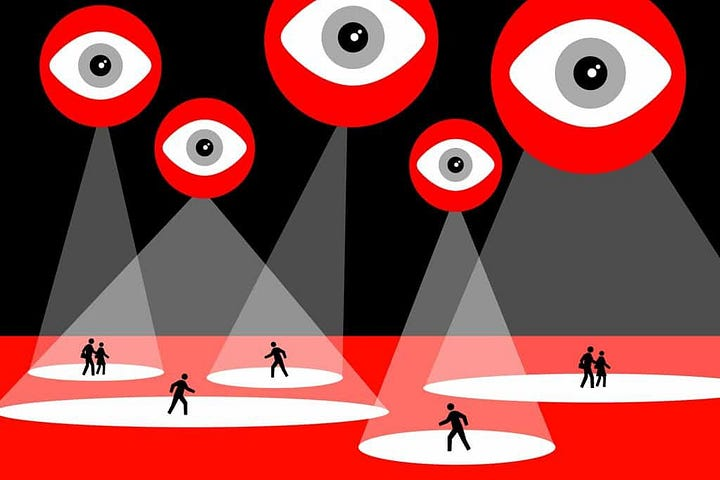
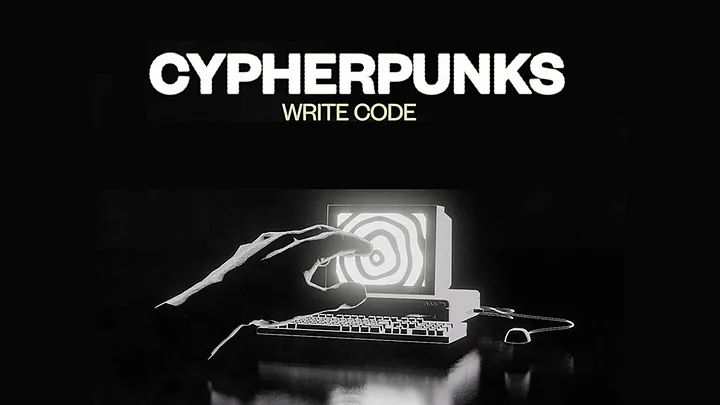
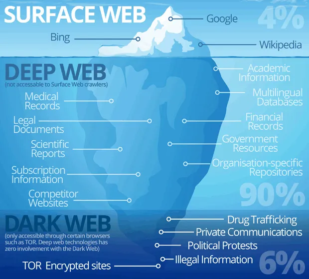

```
Traduzido por: pipipi popopo
Revisado por: peixe lua
```
[```ver lista de contribuidores```](/about/#contribuidores)

# Cypherpunks 101

## Privacy Matters: Cypherpunks, Crypto-Anarchists And Their Enemies

The terms “cypherpunk” and “crypto-anarchism” do not feature often in mainstream media. In recent years, Edward Snowden and Julian Assange helped popularize these terms to a degree but it is still unclear to most what these terms stand for. Knowing about these movements has now become imperative to raise awareness about early signs of the coming to life of a dystopian surveillance apparatus.

The cypherpunk and crypto-anarchist movements have been fierce privacy and freedom activists since the 1980s who predicted exactly what our society would come to be if the spread of technology was not accompanied by privacy enhancing technologies and regulations. Forty years later, we find ourselves in a world where corporations and governments can have access to our personal information without us even knowing. The same technology that was supposed to give us more abilities to associate freely and express ourselves is turning into a cage.

### Cypherpunks & Crypto-anarchists: Who Are They?

The cypherpunk movement was born at the end of the 80s and was initiated by Eric Hughes, Timothy C. May, and John Gilmore. Inaugurated by Timothy May’s CryptoAnarchist’s Manifesto, the cypherpunk movement focuses on privacy issues on the open web, defining privacy as: “the power to selectively reveal oneself to the world” (Hughes, ed. Ludlaw, 2001, p. 81). Their main goal is then to prevent the revealing of unnecessary information that is commonly required by transactions. As Hughes writes:

>“We the Cypherpunks are dedicated to building anonymous systems. We are defending our privacy with cryptography, with anonymous mail forwarding systems, with digital signatures, and with electronic money. Cypherpunks write code. We know that someone has to write software to defend privacy, and since we can’t get privacy unless we all do, we’re going to write it. We publish our code so that our fellow Cypherpunks may practice and play with it […]. Cypherpunks deplore regulations on cryptography, for encryption is fundamentally a private act. The act of encryption, in fact, removes information from the public realm. Even laws against cryptography reach only so far as a nation’s border and the arm of its violence. Cryptography will ineluctably spread over the whole globe and with it the anonymous transactions systems that it makes possible” (May, ed. Ludlaw, 2001, p. 83).


*From [Bitcoin Magazine](https://bitcoinmagazine.com/culture/crypto-art-of-resistance-remember-remember-the-legacy-of-the-cypherpunks)*

Cypherpunks have fought several battles against the U.S government, namely by filing lawsuits against it for its attempts to limit cryptography and also by inciting civil unrest. While many of their achievements continued to be hampered by the government, some of their accomplishments such as MintChip, Canadian e-wallet, and Bitcoin, could not be restrained — and continue to not only exist — but thrive.

Crypto-anarchism is another important movement developed by the early cypherpunks. While retaining the same principles of the cypherpunk movement, crypto-anarchism frames itself as a more encompassing political movement. As the name suggests, crypto-anarchism proposes to overcome the purview of traditional nation states and found a society based on freedom of association, cooperation, egalitarianism, economic libertarianism, and decentralization.

According to crypto-anarchism, cryptographic methods will alter the nature of corporations and of government interference in economic and social transactions. As May puts it: “Combined with emerging information markets, crypto anarchy will create a liquid market for any and all material which can be put into words and pictures’’ (May, ed. Ludlaw, 2001).

Crypto-anarchists are not only committed to building software that can provide protection against State abuses: They also strive to build new socioeconomic structures through computer code. In this context, it is possible to understand how crypto-anarchist ideas and values are reflected in the architecture of blockchain technology. Blockchain allows a collective of people to formulate, disseminate, maintain and verify an institutional system while recording the interactions within it (MacDonald, Allen and Potts, 2016). It allows us to change the very ways we govern ourselves as collectives and provides the basis for a non-coercive, consensus based society.

### Surveillance, Money and the State

Today we are forced to deal with economic and political institutions that are expensive and exclusionary: They have a high potential for error and they intrude into users’ personal privacy without oversight or accountability. In many ways, such institutions are the key stakeholders of a dystopian world of oppression, in which technology is exclusively managed by the state and massive corporations. Yet, the most problematic part is that we are not fully aware of the fact that mass surveillance has become increasingly cheap, invisible, and pervasive. The most popular argument that pops up when someone hears about a loss of privacy is: “But I have nothing to hide, so I don’t care”. However, privacy is not about hiding the wrong, but rather about having control over one’s own communication. In the “nothing to hide” logic, the choice comes down to a passive acceptance of mass surveillance instead of an active defense of one’s own rights.



Companies like Facebook, Google and Amazon have succeeded in making users’ online life more and more comfortable by allowing them to purchase an item within a few minutes, receive relevant information based upon earlier internet surfing, by automatically finding a recognized friend’s face on the picture. The downside of such “convenience” is that big corporations and government agencies exploit and often misuse user’s private data for personal returns (see Shoshana Zuboff, The Age of Surveillance Capitalism).

>“Privacy is necessary for an open society in the electronic age. Privacy is not secrecy. A private matter is something one doesn’t want the whole world to know, but a secret matter is something one doesn’t want anybody to know. Privacy is the power to selectively reveal oneself to the world.”

While technology has undoubtedly become a great asset for boosting our efficiency, we cannot ignore the fact that the power asymmetries that result from the current state of affairs increases users’ vulnerability. Hence, the goal is to find an optimal way to deploy technology to serve users’ best interests while also ensuring the integrity of the process from start to finish.

## Encryption As A Way To Re-Establish Privacy and Autonomy

### Encryption And The Financial System

Crypto-anarchism is a movement that uses encryption to allow users to exist online anonymously. It strives to free private data from institutional surveillance. “Encryption” is the method of storing and transmitting data in a particular form so that only those for whom it is intended can read and process it. While encryption can be highly beneficial for individual users, it is often interpreted as a threat to governments and related agencies, who have a vested interest in monitoring communications as well as economic transactions.



At root, the value proposition of encryption is closely related to the structure of the modern financial system and the relationship between governments and financial service providers. While this relationship has evolved over time, the financial crisis of 2007–2008 illustrated the excessive confidence in existing markets’ efficiency by a number of centralized and ‘too-big-to-fail’ institutions. In the context of the crisis, major banks lent huge volumes of money to one another, while average citizens remained at the mercy of these institutions for accessing, handling and transaction value. As a result of this system, many countries continue to experience the consequences of the — 14 years and running — monetary policy failure.

Austerity, huge debts, increased unemployment and overall political instability beg the question: What can we learn about the role of the State from this? To save the economy from failure, governments around the globe have (and continue to) pump billions of dollars into the financial system to rescue national banks. This expansive fiscal policy does not offer a long-term solution to the fundamentally degraded fiscal policy of Central Banks. That is not to say that the government interventions were completely useless, but rather that our (economic) reality today is too complex to be controlled by money alone.

Crypto-anarchism highlights the weaknesses of the current economies when it comes to absorbing shocks and the inability of the states to come up with effective and sustainable solutions. Crypto-anarchism seeks to build an alternative reality where citizens can redefine their economical interactions, strive towards socio-egalitarianism and potentially achieve greater agency.

### Realizing The Open Web For A Freer Society


For years cypherpunks and crypto-anarchists have warned us about the dangers of an overtly centralised state apparatus. They have opposed the status quo by developing the technological means to escape surveillance and engaged in overt resistance to state oppression. Their work has been impactful, while, nevertheless, surveillance capitalism continues to thrive at the expense of people’s freedom and agency. In this context, the adoption of a technology that prevents tech giants and the state alike from holding a disproportionate amount of power and information over people becomes crucial in order to safeguard fundamental freedoms, rights and human dignity.

The Open Web, and its core underlying technology, have the capacity to ground a pathway towards a society where privacy, freedom, and transparency are provided to its citizens. It is therefore crucial that its development is followed, and encouraged.

The development of privacy enhancing technologies, however, should go hand in hand with raising awareness of the importance of privacy. The implications of corporate and government access to personal data is still not fully understood, as the mainstream narrative surrounding privacy belittles the importance of user’s control over their information.

The fight for privacy and freedom is not only fought at a technological level but also at an intellectual level. Combatting mainstream narratives that portray privacy as a danger to society need to be resisted and dismantled with the help of logic and common sense. If technology will enable us to create new possibilities it is only words and reason that will allow us to use it for human and freedom enhancing purposes.

## Common Myths And Misconceptions About Cypherpunks

### Myth 1: Cryptocurrency Is Just Another Currency


One of the major competitive advantages of blockchain technology over the state is high security. Historically, institutional systems have developed different ways to record transactions of all kinds. The goal has always been to create a system that would be resilient to theft of information, corruption and manipulation. Today the nexus of power has become hopelessly corrupt and hence the state fails on these premises. We know this because of the digital profiling or detailed pictures of each individual based on the online activity. All big corporations are chasing consumer behavior because they can extract huge value from it. Cryptocurrencies, as a decentralized peer-to-peer digital system for the exchange of value, offer an alternative model to the current state of art financial instruments, where financial information is controlled and traced by the state and related institutions.

Cryptocurrencies, thus are more than simply another currency. In virtue of being based on public distributed ledgers, they provide a foundation for creating new ways to handle financial data, outside of the reach of surveillance capitalists. This is exactly the reason why cryptocurrencies were so well-received in the crypto-anarchist community and beyond. From a crypto-anarchist perspective, several blockchain applications have the potential to enable self-sustaining economic organisation. Besides control over data, cryptocurrencies offer another, more effective, anti-inflatory economic model. Bitcoin, for instance, grows organically due to the limited number of coins and hence circumvents inflation. Other cryptocurrencies, meanwhile, have been designed to be private, anonymous and fast making them popular in Dark Web markets.

### Myth 2: The Dark Web Is For Human-Trafficking And Drug Exploitation

>The dark web is the hidden collective of internet sites only accessible by a specialized web browser. It is used for keeping internet activity anonymous and private, which can be helpful in both legal and illegal applications. While some use it to evade government censorship, it has also been known to be utilized for highly illegal activity. (What Is The Deep Dark Web, 2020)

When the term ‘Dark Web’ comes up, there is a tendency to assume that only people engaged in illegal activity would want to use it. Contrary to the various stereotypes and biases, the Deep Web is largely composed of safe content like public and private databases and intranets that we use every day. The face of crime has undoubtedly changed with the birth of anonymizing browsers like Tor, but as crypto-anarchists emphasize there is a beneficial side to the hidden internet. For instance, the Deep Web can be seen as a new, more democratic commercial area. Imagine, that it was not only a place to bypass the local geographical restrictions and watch a local TV but a place where one can buy otherwise unaffordable medicines to treat cancer patients? Can it become another equivalent of eBay?



Realizing the crypto-anarchist dream, the features of the Deep Web accurately represent values such as retention, reciprocity and integrity. An absence of web page indexing and network security like encryption protects users from Google and others accessing their data. Anonymous markets, therefore, should not only exist for drugs but also for food, medicines and more. Prices on the black market have the capacity to make products more accessible. ***Most importantly, any understanding of the ‘Dark Web’ must be mindful of the current context of surveillance and rash disregard for privacy that much of the world lives through today.*** It is therefore highly appealing to rejuvenate the concept of the Deep Web from the crypto-anarchist angle and explore its potential usability for improving data privacy and building an alternative economic system: We may consider the Dark Web as a means by which users can fight against totalitarianism.

#### Useful Resources

[Security Without Identification: Card Computers to Make Big Brother Obsolete](https://chaum.com/security-without-identification/) (1985)

[Crytography’s Role in Securing the Information Society,](https://nap.nationalacademies.org/catalog/5131/cryptographys-role-in-securing-the-information-society) edited by Kenneth W. Dam and Herbert S. Lin (1996)

A seminal work in the field, Diffie and Hellman’s [“New Directions in Cryptography”](https://ee.stanford.edu/~hellman/publications/24.pdf) (1976)

[Cypherpunks: Freedom and the Future of the Internet,](https://resistir.info/varios/assange_livro_port.pdf) Julian Assange (2012)

[“Battle of the Clipper Chip”](https://www.nytimes.com/1994/06/12/magazine/battle-of-the-clipper-chip.html) in The New York Times (1994)

[The Evolution of US Government Restrictions on Using and Exporting Encryption Technologies](http://www.foia.cia.gov/sites/default/files/DOC_0006231614.pdf) (FOIA: 2010)
---
Fonte: 
* https://cypherpunkguild.medium.com/cypherpunks-101-ep-1-82d91f13aa2

* https://cypherpunkguild.medium.com/cypherpunks-101-ep-2-314bf6f054a2

* https://cypherpunkguild.medium.com/cypherpunks-101-ep-3-common-myths-and-misconceptions-about-cypherpunks-260b2f5f72eb