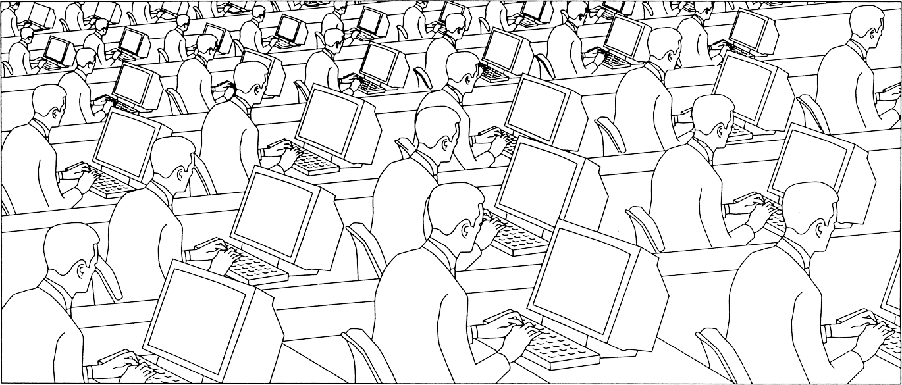
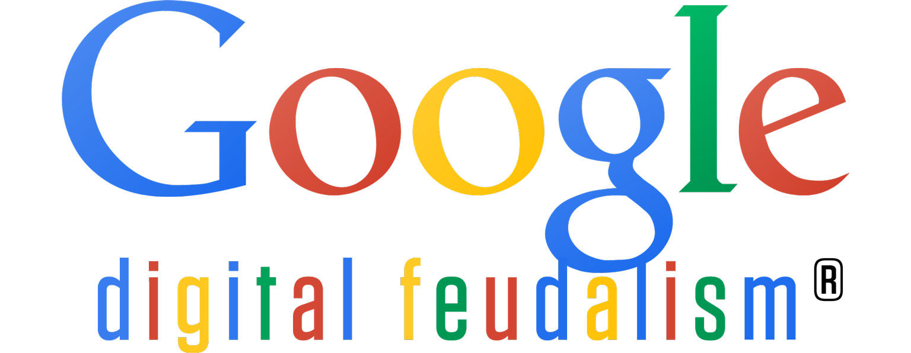

```
Tradução por: Traduza_e_coloque_seu_nome_aqui
Formatação e revisão: Matheus Bach, revise_para_estar_aqui
```
[```ver lista de contribuidores```](/about/#contribuidores)

# Deserting the Digital Utopia

## Computers against Computing

> _“There is an invisible world connected at the handle to every tool—use the tool as it is intended, and it fits you to the mold of all who do the same; disconnect the tool from that world, and you can set out to chart others.”  
>   
> –[_Hunter/Gatherer_](https://crimethinc.com/zines/hunter-gatherer-1)_

The ideal capitalist product would derive its value from the ceaseless unpaid labor of the entire human race. We would be dispensable; it would be indispensable. It would integrate all human activity into a single unified terrain, accessible only via additional corporate products, in which sweatshop and marketplace merged. It would accomplish all this under the banner of autonomy and decentralization, perhaps even of “direct democracy.”

Surely, were such a product invented, some well-meaning anti-capitalists would proclaim that the kingdom of heaven was nigh—it only remained to subtract capitalism from the equation. The anthem of the lotus-eaters.

It would not be the first time dissidents have extrapolated their utopia from the infrastructure of the ruling order. Remember the enthusiasm Karl Marx and Ayn Rand shared for railroads! By contrast, we believe that the technology produced by capitalist competition tends to incarnate and impose its logic; if we wish to escape this order, we should never take its tools for granted. _When we use tools, they use us back._

Here follows our attempt to identify the ideology built into digital technology and to frame some hypotheses about how to engage with it.

## The Net Closes

In our age, domination is not just imposed by commands issued from rulers to ruled, but by algorithms that systematically produce and constantly recalibrate power differentials. The algorithm is the fundamental mechanism perpetuating today’s hierarchies; it determines the possibilities in advance, while offering an illusion of freedom as choice. The digital reduces the infinite possibilities of life to a lattice of interconnecting algorithms—to choices between zeros and ones. The world is whittled down to representation, and representation expands to fill the world; the irreducible disappears. That which _does not compute_ does not exist. The digital can present a breathtaking array of choices—of possible combinations of ones and zeros—but the terms of each choice are set in advance.

A computer is a machine that performs algorithms. The term originally designated a human being who followed orders as rigidly as a machine. Alan Turing, the patriarch of computer science, named the digital computer as a metaphorical extension of the most impersonal form of human labor: “The idea behind digital computers may be explained by saying that these machines are intended to carry out any operations which could be done by a human computer.” In the fifty years since, we have seen this metaphor inverted and inverted again, as human and machine become increasingly indivisible. “The human computer is supposed to be following fixed rules,” Turing continued; “he has no authority to deviate from them in any detail.”

Just as timesaving technologies have only made us busier, giving the busywork of number crunching to computers has not freed us from busywork—it has made computing integral to every facet of our lives. In post-Soviet Russia, numbers crunch you.

Since the beginning, the object of digital development has been the convergence of human potential and algorithmic control. There are places where this project is already complete. The iPhone “Retina display” is so dense that an unaided human eye cannot tell it is comprised of pixels. There are still gaps between the screens, but they grow smaller by the day.

The Net that closes the space between us closes the spaces within us. It [encloses commons](https://crimethinc.com/blog/2013/06/10/prism-the-internet-as-new-enclosure/) that previously resisted commodification, commons such as _social networks_ that we can only recognize as such now that they are being mapped for enclosure. As it grows to encompass our whole lives, we have to become small enough to fit into its equations. Total immersion.

### Information Everywhere, Communication Nowhere



## The Digital Divides

Well-intentioned liberals are concerned that there are entire communities not yet integrated into the global digital network. Hence free laptops for the “developing world,” hundred-dollar tablets for schoolchildren. They can only imagine the _one_ of digital access or the _zero_ of digital exclusion. Given this binary, digital access is preferable—but the binary itself is a product of the process that produces exclusion, not a solution to it.

> _“We were once told that the airplane had ‘abolished frontiers’; actually, it is only since the airplane became a serious weapon that frontiers have become definitely impassable.”  
>   
> –George Orwell,  
> [“You and the Atomic Bomb”](https://web.archive.org/web/20130310044800/http://tmh.floonet.net/articles/abombs.html)_

The project of computerizing the masses recapitulates and extends the unification of humanity under capitalism. No project of integration has ever extended as widely or penetrated as deeply as capitalism, and the digital will soon fill its entire space. “The poor don’t have our products yet!”—that’s the rallying cry of Henry Ford. Amazon.com sells tablets below cost, too, but they acknowledge it as a business investment. Individual workers depreciate without digital access; but being available at a single click, compelled to compete intercontinentally in real time, will not make the total market value of the working class _appreciate._ Capitalist globalization has already shown this. More mobility for individuals does not ensure more parity across the board.

To _integrate_ is not necessarily to _equalize_: the leash, the rein, and the whip are also connective. Even where it connects, the digital divides.

Like capitalism, the digital divides haves from have-nots. But a computer is not what the has-not lacks. The has-not lacks _power,_ which is not apportioned equally by digitization. Rather than a binary of capitalists and proletarians, a universal market is emerging in which each person will be ceaselessly evaluated and ranked. Digital technology can impose power differentials more thoroughly and efficiently than any caste system in history.

Already, your ability to engage in social and economic relations of all kinds is determined by the quality of your processor. At the lower end of the economic spectrum, the unemployed person with the smartphone snaps up the cheaper ride on Craigslist (where hitchhiking used to be equal opportunity). At the upper end, the high-frequency trader profits directly on the processing power of his computers (making old-fashioned stockbroking look fair by comparison), as does the Bitcoin miner.

It is unthinkable that digital equality could be built on such an uneven terrain. The gap between rich and poor has not closed in the nations at the forefront of digitization. The more widespread digital access becomes, the more we will see social and economic polarization accelerate. Capitalism produces and circulates new innovations faster than any previous system, but alongside them it produces ever-increasing disparities: where equestrians once ruled over pedestrians, stealth bombers now sail over motorists. And the problem is not just that capitalism is an unfair competition, but that it imposes this competition on every sphere of life. Digitization makes it possible to incorporate the most intimate aspects of our relations into its logic.

The digital divide doesn’t just run between individuals and demographics; it runs _through_ each of us. In an era of precarity, when everyone simultaneously occupies multiple shifting social and economic positions, digital technologies selectively empower us according to the ways we are privileged while concealing the ways we are marginalized. The grad student who owes fifty thousand dollars communicates with other debtors through social media, but they are more likely to share their résumés or rate restaurants than to organize a debt strike.

Only when we understand the protagonists of our society as networks rather than freestanding individuals can the gravity of this hit home: digital collectivity is premised on market success, whereas we all experience failure in isolation. In the social networks of the future—which advertisers, credit agencies, employers, landlords, and police will monitor in a single matrix of control—we may only encounter each other insofar as we affirm the market and our value on it.

> _The more widespread digital access becomes, the more we can expect to see social and economic polarization accelerate._

## The System Updates

Competition and market expansion have always stabilized capitalism by offering new social mobility, giving the poor a stake in the game just when they had no more reason to play along. But now that the entire world is integrated into a single market and capital is concentrating in the hands of a shrinking elite, what could forestall a new wave of revolt?

The aforementioned Henry Ford was one of the innovators who responded to the last major crisis that threatened capitalism. Raising salaries and increasing mass-production and credit, he expanded the market for his products—undercutting the revolutionary demands of the labor movement by turning producers into consumers. This encouraged even the most precarious workers to aspire to inclusion rather than revolution.

The following generation’s struggles erupted on a new terrain, as consumers reprised producers’ demand for self-determination in the marketplace: first as a demand for individuality, and then, when that was granted, for autonomy. This culminated with the classic imperative of the do-it-yourself counterculture—“Become the media”—just as the global telecommunications infrastructure was miniaturized to make individual workers as flexible as national economies.

We have become the media, and our demand for autonomy has been granted—but this has not rendered us free. Just as the struggles of producers were defused by turning them into consumers, the demands of consumers have been defused by turning them into producers: where the old media had been top-down and unidirectional, the new media derive their value from user-created content. Meanwhile, globalization and automation eroded the compromise Ford had brokered between capitalists and a privileged subset of the working class, producing a redundant and precarious population.

In this volatile context, new corporations like Google are updating the Fordist compromise via free labor and free distribution. Ford offered workers greater participation in capitalism via mass consumption; Google gives everything away for free by making everything into an unpaid job. In offering credit, Ford enabled workers to become consumers by selling their future as well as present labor; Google has dissolved the distinction between production, consumption, and surveillance, making it possible to capitalize on those who may never have anything to spend at all.

Attention itself is supplementing financial capital as the determinant currency in our society. It is a new consolation prize for which the precarious may compete—those who will never be millionaires can still dream of a million youtube views—and a new incentive to drive the constant innovation capitalism necessitates. As in the financial market, corporations and individuals alike may try their luck, but those who control the structures through which attention circulates wield the greatest power. Google’s ascendancy does not derive from advertising revenue or product sales but from the ways it shapes the flows of information.

Looking ahead down this road, we can imagine a digital feudalism in which finance capital and attention have both been consolidated in the hands of an elite, and a benevolent dictatorship of computers (human and otherwise) maintains the Internet as a playpen for a superfluous population. Individual programs and programmers will be replaceable—the more internal mobility a hierarchical structure offers, the more robust and resilient it is—but the structure itself will be nonnegotiable. We can even imagine the rest of the population participating on an apparently horizontal and voluntary basis in refining the programming—within certain parameters, of course, as in all algorithms.

Digital feudalism could arrive under the banner of direct democracy, proclaiming that everyone has the right to citizenship and participation, presenting itself as a solution to the excesses of capitalism. Those who dream of a guaranteed basic income, or who wish to be compensated for the online harvesting of their “personal data,” must understand that these demands would only be realized by an all-seeing surveillance state—and that such demands legitimize state power and surveillance even if they are never granted. Statists will use the rhetoric of digital citizenship to justify mapping everyone in new cartographies of control, fixing each of us to a single online identity in order to fulfill their vision of a society subject to total regulation and enforcement. “Smart cities” will impose algorithmic order on the offline world, replacing the unsustainable growth imperative of contemporary capitalism with new imperatives: surveillance, resilience, and management.

In this dystopian projection, the digital project of reducing the world to representation converges with the program of electoral democracy, in which only representatives acting through the prescribed channels may exercise power. Both set themselves against all that is incomputable and irreducible, fitting humanity to a Procrustean bed. Fused as electronic democracy, they would present the opportunity to vote on a vast array of minutia, while rendering the infrastructure itself unquestionable—_the more participatory a system is, the more “legitimate.”_ Yet every notion of citizenship implies an excluded party; every notion of political legitimacy implies a zone of illegitimacy.

Genuine freedom means being able to determine our lives and relations from the ground up. We must be able to define our own conceptual frameworks, to formulate the questions as well as the answers. This is not the same as obtaining better representation or more participation in the prevailing order. Championing digital inclusivity and “democratic” state stewardship equips those who hold power to legitimize the structures through which they wield it.

It is a mistake to think that the tools built to rule us would serve us if only we could depose our masters. That’s the same mistake every previous revolution has made about police, courts, and prisons. The tools of liberation must be forged in the struggle to achieve it.



## The Social Networks

We contemplate a future in which digital systems will meet our every need, as long as we ask only for the present order _delivered instantly._ Tracing the trajectory of our digital imaginary, we will soon be always voting, always working, always shopping, always in jail. Even fantasies that separate the soul from the body to travel inside the computer leave the liberal subject intact: every post-humanism we have been offered has been a neoliberalism, every one.

Liberal gradualists fighting for online privacy and net neutrality figure the subalterns they are defending as _individuals._ But as long as we operate according to the paradigm of “human rights,” our attempts to organize against systems of digital control will only reproduce their logic. The regime of constitutions and charters that is presently coming to an end didn’t just protect the liberal subject, the individual—it invented it. Each of the rights of the liberal subject implies a lattice of institutional violence to ensure its functional atomization—the partitioning of private property, the privacy of voting booths and prison cells.

If nothing else, the ostentatious networking of daily life underscores the fragility of liberal individuality. Where does “I” begin and end, when my knowledge is derived from search engines and my thoughts are triggered and directed by online updates? Countering this, we are encouraged to shore up our fragile individualism by constructing and disseminating autobiographical propaganda. The online profile is a reactionary form that attempts to preserve the last flickering ember of the liberal subjectivity by selling it. Say, “identity economy.”

But the object of exploitation is a network, and so is the subject in revolt. Neither have ever resembled the liberal individual for very long. The slave galley and the slave uprising are both networks composed of some aspects of many people. Their difference consists not in different types of people, but different principles of networking. Every body contains multiple hearts. The perspective that digital representation provides on our own activity enables us to clarify that we are pursuing a conflict between rival organizational principles, not between specific networks or individuals.

The networks produced and concealed by liberalism are inevitably hierarchical. Liberalism seeks to stabilize the pyramid of inequality by forever widening its base. Our desire is to level pyramids, to abolish the indignities of domination and submission. We do not demand that the rich give to the poor; we seek to cut down the fences. We cannot say that the digital is _essentially_ hierarchical, because we know nothing of “essences”; we only know that the digital is _fundamentally_ hierarchical, in that it is built upon the same foundation as liberalism. If a different digital is possible, it will only emerge on a different foundation.

We don’t need better iterations of existing technology; we need a better premise for our relations. New technologies are useless except insofar as they help us to establish and defend new relations.

Social networks preexist the internet; different social practices network us according to different logics. Understanding our relations in terms of circulation rather than static identity—in terms of trajectories rather than locations, of forces rather than objects—we can set aside the question of individual rights and set out to create new collectivities outside the logic that produced the digital and its divides.


## The Force Quits

For every action, there is an equal and opposite reaction. Integration creates new exclusions; the atomized seek each other. Every new form of control creates another site of rebellion. Policing and security infrastructure have increased exponentially over the past two decades, but this has not produced a more pacified world—on the contrary, the greater the coercion, the more instability and unrest. The project of controlling populations by digitizing their interactions and environments is itself a coping strategy to forestall the upheavals that are bound to follow the economic polarization, social degradation, and ecological devastation wrought by capitalism.

The [wave of uprisings](https://crimethinc.com/texts/recentfeatures/nightmares.php) that has swept the globe since 2010—from [Tunisia](https://crimethinc.com/blog/2011/12/17/self-destruction/) and [Egypt](https://crimethinc.com/blog/2011/02/02/egypt-today-tomorrow-the-world/) through [Spain](https://crimethinc.com/texts/recentfeatures/rosefire.php) and [Greece](https://crimethinc.com/blog/2008/12/25/how-to-organize-an-insurrection/) to the worldwide Occupy movement, and most recently [Turkey](https://crimethinc.com/blog/2013/06/19/postcards-from-the-turkish-uprising/) and [Brazil](https://crimethinc.com/texts/recentfeatures/brazilpt1.php)—has largely been understood as a product of the new digital networks. Yet it is also a reaction against digitization and the disparities it reinforces. News of Occupy encampments spread via the Internet, but those who populated them were there because they were unsatisfied with the merely virtual—or because, being poor or homeless, they had no access to it at all. Before 2011, who could have imagined that the Internet would produce a worldwide movement premised on permanent presence in shared physical space?

This is only a foretaste of the backlash that will ensue as more and more of life is fitted to the digital grid. The results are not foreordained, but we can be sure there will be new opportunities for people to come together outside and against the logic of capitalism and state control. As we witness the emergence of digital citizenship and the identity market, let us begin by asking what technologies the digitally excluded non-citizen will need. The [tools employed](http://motherboard.vice.com/blog/the-revolution-will-be-live-mapped-a-brief-history-of-protest-maptivism) during the fight for Gezi Park in Istanbul in summer 2013 could present a humble starting place. How can we extrapolate from protest mapping to the tools that will be necessary for insurrection and survival, especially where the two become one and the same? Looking to Egypt, we can see the need for tools that could coordinate the sharing of food—or disable the military.

Understanding the expansion of the digital as an enclosure of our potential doesn’t mean ceasing to use digital technology. Rather, it means changing the logic with which we approach it. Any positive vision of a digital future will be appropriated to perpetuate and abet the ruling order; the reason to engage on the terrain of the digital is to destabilize the disparities it imposes. Instead of establishing digital projects intended to prefigure the world we wish to see, we can pursue digital practices that disrupt control. Rather than setting out to defend the rights of a new digital class—or to incorporate everyone into such a class via universal citizenship—we can follow the example of the disenfranchised, beginning from contemporary uprisings that radically redistribute power.

Understood as a class, programmers occupy the same position today that the bourgeoisie did in 1848, wielding social and economic power disproportionate to their political leverage. In the revolutions of 1848, the bourgeoisie sentenced humanity to two more centuries of misfortune by ultimately siding with law and order against poor workers. Programmers enthralled by the Internet revolution could do even worse today: they could become digital Bolsheviks whose attempt to create a democratic utopia produces the ultimate totalitarianism.

On the other hand, if a critical mass of programmers shifts their allegiances to the real struggles of the excluded, the future will be up for grabs once more. But that would mean abolishing the digital as we know it—and with it, themselves as a class. Desert the digital utopia.


---
Fonte: https://pt.crimethinc.com/2013/10/04/feature-deserting-the-digital-utopia