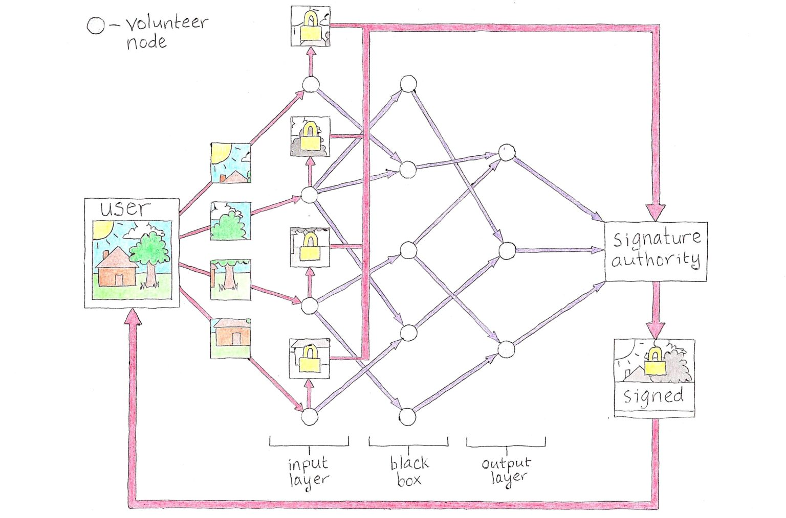

```
Tradução por: Traduza_e_coloque_seu_nome_aqui
Formatação e revisão: Matheus Bach, revise_para_estar_aqui
```
[```ver lista de contribuidores```](/about/#contribuidores)

# ZKANN: A Possible Solution to the Content Problem

I read [this](https://techcrunch.com/2018/12/20/whatsapp-pornography/) article recently, and I have an idea for how to solve the problem it presents. The article is about how WhatsApp and other platforms with end-to-end encryption are being used to spread pedophilia. End-to-end encryption is essential for online privacy. Without it, service providers are able to eavesdrop on your communications, see your pictures and piece together your whole life. That might be okay if you could trust them to keep your information private, but they won’t. They use it to categorize you, track you, and sell you to advertisers, or give you over to Big Brother.

However, as the article points out, some people are abusing that privacy. When their content is encrypted, there is no way to distinguish it from all the other encrypted content flowing through the system. If something is not done about it, we could lose this important privacy-enhancing tool in the name of going after these bad actors. What we need is a way to separate the harmful content from the rest without actually looking at any of it! I call this “the content problem.” On its face, this seems like an impossible task. However, through a combination of cryptography and artificial intelligence, there may be a way.

## Enter ZKANN

Platforms already deal with the content problem. Their users generate way too much content for their staff to look at and read everything that gets posted. So, they use algorithms to filter and categorize content so harmful content gets flagged or removed automatically. One algorithm they use is called an “artificial neural network” (ANN). ANNs are at the heart of machine learning and much of the recent advances in AI.

ANNs are inspired by the way brains work. They are made up of a bunch of simulated neurons connected to each other in a network. Each neuron is very simple. It fires a downstream signal to the neurons it is connected to, only if its upstream neurons fire strongly enough to it. How those neurons are connected — the topology of the network — is what gives rise to the complexity of the ANN and allows it to perform superhuman tasks, like quickly filtering through mountains of user content.

The topology is created by feeding lots of content into the ANN, rewarding it when it correctly identifies a piece of content and punishing it when it gets it wrong. The reward strengthens the neural connections that led to a correct outcome, while the punishment weakens the connections that led to an incorrect outcome. After many rounds of trial and error in a process called “training,” the ANN can then correctly identify new content. It has “learned” what should and should not get through its filter.

It is important to note that the ANN’s topology is essentially a black box. Just as we cannot read a person’s thoughts by looking at a brain scan, we do not know how ANNs make the decisions they make. This has been cited as a problem before. What if, for example, an ANN was trained on a dataset containing an unknown racial bias. It could then be making racist decisions and we would not know it. However, we can use this inability to scrutinize the inner workings of ANNs to our advantage as we solve the content problem.

The solution I propose involves a quasi-decentralized ANN and uses cryptography to ensure that no single node can see more than a tiny piece of the content being scrutinized. That piece is too small for the node to have any idea what the content is, yet as a whole the network can classify it. I call this construct a “zero knowledge artificial neural network,” or ZKANN (pronounced zee-can).

It starts by training an ANN the old-fashioned way: feeding lots of content into a new ANN until it can differentiate between harmful and normal content. It could be fruitful to partner in this task with law enforcement agencies that have seized and secured such content during investigations. Thankfully, no one need view the content as it is fed through the ANN, and the process could be performed in a secure facility. A wide variety of normal content should also be used for training so as to minimize false positives. Once the ANN is trained, it is released to the public so it can be used as the basis for ZKANNs.



As seen in Figure 1, there are three types of participant in a ZKANN: the user, volunteer nodes and the signature authority (SA). Volunteer nodes are operated by independent volunteers who wish to contribute their idle computing resources to identifying harmful content online, and the signature authorities are widely trusted parties who sign content deemed “not harmful” by the ZKANN. We will first look at the case where all three participants are cooperating and playing their role as intended. Then, we will look at scenarios where they could deviate and try to game the system.

The process starts with the user selecting a SA and a public ANN. The SA responds that it is ready and node operators start volunteering to participate. Each one will play the role of an artificial neuron in the ANN being used.

Every ANN has what is known as an “input layer.” The nodes in the input layer accept as input a small piece of the content being analyzed. For example, each input-layer node could accept a number representing the color of an individual pixel from an image. If the image is made up of 100 pixels, there would be 100 input-layer nodes, one for each pixel.

The volunteer nodes in our ZKANN that wind up in the input layer will now each receive from the user a tiny piece of the content being analyzed. In Figure 1, the content (an image of a house) is only broken into four pieces. In practice, there would be many more and many more volunteer nodes in general. Because each node is operated independently, no single one has access to more than a tiny piece of the content and thus cannot determine what the content is.

Now, our input-layer nodes will perform two important operations. First, they will send a signal to their downstream node operators according to the topology of the public ANN being used (purple arrows). This signal carries some information about the tiny piece of content it is based on, but not enough for the downstream node to determine what the original content is. Second, the input-layer nodes will encrypt their tiny portion of the content with the key(s) used in the end-to-end encryption scheme and send it to the SA (red arrows). Once the SA has all the separately encrypted pieces, it bundles them and waits for the final signal from the output layer.

The output layer is the last set of nodes in the ZKANN. They send their downstream signals to the SA who uses those signals to make the final determination whether the original content is harmful or not. Because the ANN operates like a black box, there is no way for the SA — or any of the nodes — to independently work their way back to the original content. But, miraculously, the SA can say whether or not the content is harmful based on its incoming signals. If, based on those, the data is deemed “not harmful,” it cryptographically signs the encrypted bundle of content and sends it back to the user.

Now, without ever having revealed more than a tiny piece of content to any one participant, the user can show service providers that the content is not harmful and they can serve that user with a clear conscience.

## Further Development

As a prisoner, I cannot build prototypes, research or develop ZKANNs, and there are some areas that need work. If you noticed, I was sure to make clear that the node operators must be independent. The ZKANN construct only works as intended if no single participant controls more than a small fraction of the volunteer nodes being used. If someone other than the user controlled all the input-layer nodes, for example, they could piece together the fragments of the content, and the user’s privacy would be lost. On the other hand, a malicious user controlling a large fraction of the volunteer nodes could send signals corresponding to normal content even if the original content was harmful and trick a SA into signing harmful content.

The way I see it, a service like WhatsApp could enlist the help of a handful of independent organizations who want to contribute to fighting harmful content online (e.g. Wikimedia, EFF, etc.) to act as SAs. Users could select the ones they want to use or just be paired at random. Then, the SA would be responsible for selecting independent nodes. This would require a degree of trust on the user’s part, but users of WhatsApp are already trusting the platform to encrypt their content in the first place. Perhaps someone can find a way to ensure node independence in a fully decentralized version of ZKANNs that does not require trust.

If we solved these problems (and others I have surely overlooked), we will have a powerful tool to fight harmful content online without violating people’s privacy. I ran the idea by some experts, and they believe it is novel and promising, but I can’t do much more with it from prison. Hopefully, someone out there will take an interest and run with it.

What ZKANNs make possible is censorship without loss of privacy. Both censorship and privacy are problematic if left unchecked, but ZKANNs pit one against the other, striking a balance that gives us the best of both worlds. Censorship without privacy can lead to loss of free speech and civilized dissent. On the other hand, as we have seen, privacy without censorship can lead to the proliferation of harmful content.

Without a technical solution, the debate over privacy and encryption will rage on, with both sides taking increasingly polarized and extreme positions. Privacy advocates have to ignore the content problem or rationalize that it is just an inevitable side-effect, outweighed by the greater good of privacy. Those on the other side say that privacy loss is a small price to pay in order to police content, or that only criminals would want privacy. Or is it that only tyrants would want a world without it?

If ZKANNs can be deployed successfully, both sides can have their cake and eat it too. The extreme anti- and pro-privacy arguments become moot. Let’s stop fighting and pop open a ZKANN.

---
Fonte: https://freeross.org/zkann/