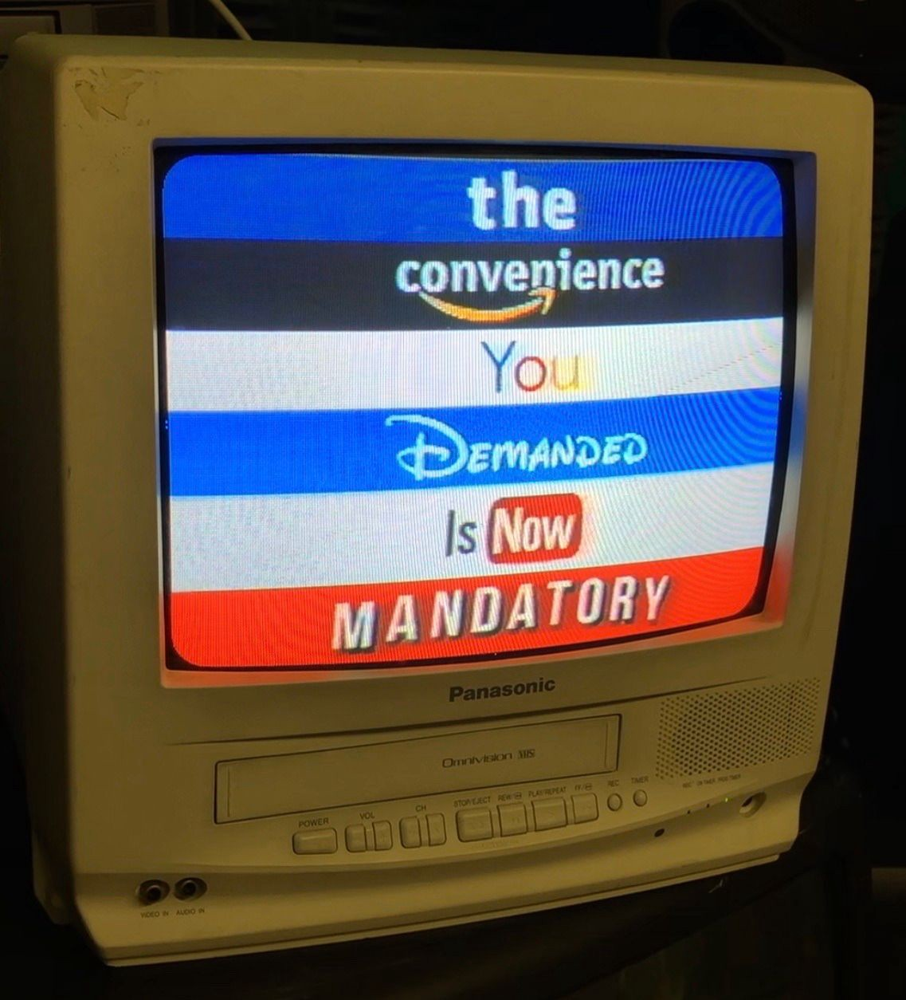

```
Traduzido por: Iann Zorkot
Revisado por: C4SS, Instituto Ágora, Matheus Bach
```

# A Internet nos Ofereceu Liberdade, Mas Nós Escolhemos a Regra Corporativa

## Logan Marie Glitterbomb



===exibe no card daqui pra baixo===

Leia qualquer um dos escritos clássicos dos cypherpunks ou dos cripto-anarquistas e uma coisa é certa: a internet nos ofereceu liberdade. Embora os movimentos de código aberto e ponto a ponto (p2p) ainda estejam vivos e bem em certos cantos da Internet, a maioria de nós escolheu a regra corporativa.

Embora as criptomoedas nos ofereçam um meio de troca que poderia ser independente de Wall Street, grandes bancos e do temido estado, muitos visitam exchanges que exigem que você confirme sua identidade ao estado e algumas até vinculam suas contas bancárias, em vez de usar recursos como o Local Bitcoins que permitiriam transações mais anônimas.

Enquanto o movimento p2p nos ofereceu uma visão da economia compartilhada que era verdadeiramente ponto a ponto, muitos, em vez disso, elogiam aplicativos corporativos que atuam como terceiros entre os pares, definindo as regras e tomando uma parte dos lucros ao fornecer pouco mais do que um aplicativo em troca; um aplicativo que poderia ter sido facilmente financiado por crowdfunding, de propriedade cooperativa de seus usuários e o tornado de código aberto para que todos pudessem utilizar como quisessem. Saudamos Uber, Lyft, AirBnB, etc. como exemplos da "economia compartilhada", em vez de buscarmos as verdadeiras opções de economia compartilhada, como Cell 411, Ridesharing ou Couchsurfing.org, que operam em um sistema verdadeiramente ponto a ponto anti-moda corporativa.

Embora nos tenham oferecido formas de comunicação e mídia social descentralizadas e criptografadas, muitos de nós ainda visitamos o Facebook, Twitter, Instagram, Discord e Tik Tok em vez de nomes como Mastodon, Minds, MeWe, Element e Signal, permitindo assim que nossos dados sejam cultivados com fins lucrativos e entregues a agências governamentais sob o pretexto de segurança. Poderíamos ter facilmente escolhido nossa privacidade, mas em vez disso escolhemos "conveniência", embora eu não tenha certeza sobre o que exatamente é conveniente em deixar que outros invadam nossa privacidade voluntariamente quando alternativas perfeitamente funcionais existem. E então, depois de entregar de boa vontade tanto poder a essas plataformas da Big Tech, alguns ficam surpresos e sentem-se traídos quando essas mesmas plataformas censuram e banem pessoas por suas visões políticas ou outras métricas que eles escolheram implementar por meio de decreto hierárquico.

Embora tenhamos oferecido opções de código aberto e / ou criptografadas, como Linux, GIMP, Icedrive, CryptDrive, Open Office, CryptPad, Riseup, Protonmail, etc., muitos ainda escolhem opções como Windows, Photoshop, Google Drive, Google Docs, Gmail, etc., assim, forrando os bolsos dos gordos corporativos e centralizando ainda mais seu controle sobre a internet ao invés de abraçar a descentralização e fortalecer criadores e comunidades menores para que possam compartilhar e colaborar uns com os outros para criar uma infinidade de plataformas incríveis.

Em um momento em que a videoconferência é muito mais necessária, a Zoom está ganhando muito dinheiro e continuamente exibindo o fato de que eles não se importam em nada com a privacidade do consumidor e tendo a audácia de – depois que foi descoberto que não havia criptografia, mesmo eles afirmando o contrário – fornecer serviços de criptografia apenas para aqueles que pagam mais por eles. Tudo isso enquanto alternativas criptografadas mais seguras, como Jitsi e Agora.io, não são usadas em comparação.

Inferno, mesmo aqui no C4SS, nós anarquistas autoproclamados ainda não podemos ajudar, mas nos entregamos ao governo corporativo. Operamos a partir de um Grupo do Google, fazemos nossa edição no Google Docs, usamos o Zoom para nossas reuniões, vendemos pela Amazon... deveríamos ser mais espertos (a propósito, você pode comprar nossos livros em nossa loja pessoal em vez de comprar via Amazon, portanto, não há necessidade de apoiar uma empresa que tem contrato com a ICE).

A Internet nos ofereceu liberdade do controle corporativo, mas jogamos fora essa oferta para continuar com prazer a tradição de lamber as botas corporativas. Muitos afirmam fazer isso por conveniência, mas desde quando é conveniente entregar todos os nossos dados pessoais de bom grado para empresas da Big Tech?

A internet nos ofereceu liberdade e nós a desperdiçamos. No entanto, a oferta ainda está lá. Está ao nosso alcance. Ainda temos a chance de lucrar com essa oferta e fazer da Internet o bastião da liberdade que foi profetizado por nossos antepassados cypherpunks e cripto-anarquistas. Será trabalhoso. Nem sempre será a transição mais fácil ou suave. Isso vai levar tempo e pesquisa. Mas dane-se caso não valha a pena no final. Então, vamos trabalhar criando a Internet que ansiamos ver.

---
Fonte: https://c4ss.org/content/53608