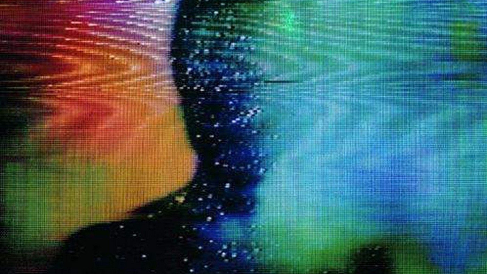

```
Revisado por: Vinicius Yaunner
```

**Nota do revisor:** Texto pode parecer meio confuso mas depois ele se encaixa bem em si próprio. Pode sofrer algumas alterações com o tempo a pedido do autor.


## Kael Avila


### ma.ni.fes.ta.ção

>[f. mɐnifəʃtɐˈsɐ̃w̃] Substantivo feminino. **1.** Ação de tornar público; ato de expressar um pensamento, ideia, ponto de vista etc; revelação: manifestação do pensamento. **2.** Ação de se expressar publicamente; ato de tornar público. **3.** Conjunto de várias pessoas que, geralmente, se juntam para expressar publicamente uma opinião, reivindicação, ideia, sentimento etc. **4.** Revelação de uma doença e/ou perturbação através de um sintoma ou da associação dos mesmos. **5.** Maneira com a qual Deus se utiliza para se comunicar com seu povo. **6.** Ação por meio da qual um iniciado e/ou médium recebe uma entidade espiritual.

Horror analógico é o nome dado para um movimento artístico e audiovisual recente. Talvez, se nossa tolice permitir, traça-se uma origem dentro do movimento de *found footage*, mas de um jeito que faça sentido dentro da vivência do mundo virtual. Digo tolo, pois a ascensão e as características desse movimento conversam em específico à uma geração e visão espacial que não é a mesma que originou, por exemplo, A Bruxa de Blair.

LOCAL 58 TV é um projeto de horror analógico. Se apresenta em vídeos que simulam resgates de transmissões de uma TV local fictícia de West Virginia. Acompanhamos transmissões confusas e mensagens inversas que nos duvidam da própria realidade enquanto fala-se sobre não ver (ou ver) a lua. Algo sobre os inimigos terem vencido. Algo sobre um horror noturno natural e maior que nós. A dúvida do que é real e o que não é causa esse sentimento particular de estar vendo algo que não deveria, o horror parte da falta de noção, das informações inversas, da suspenção da realidade.





Diferente do *found footage*, que apresentava situações modernas, o horror analógico comumente apela para, obviamente, o analógico. A estética televisiva oitentista e os elementos dos anos 2000 causam um misto de nostalgia, em seu significado puro de dor e saudade. O medo de algo que perdemos, de uma informação que deixamos passar no meio do oceano.

Isso pode apontar reflexões interessantes. A razão disso conversar diretamente com nossos sentimentos a ponto do pavor tecnológico nos diz que não só acessamos um mundo tecnológico, mas somos ligados à ele intimamente. Isso nos afeta de maneiras várias: românticas, políticas, sociais, e tudo perpassando por uma transição da nossa vivência educacional.

Dá-se à informação a curiosidade climática. A informação nos transporta para um tempo, nos faz viajar e ver pessoas que já morreram, ler os pensamentos de lugares distantes de nós. O acesso à informação se iguala à viagem no tempo e no espaço. Foi-se o tempo que o horror era sobre descobrir coisas e segredos, de saber de algo. O horror atualmente se localiza no não-saber, o que faz sentido apenas para aqueles que podem saber tudo. A negação de uma informação, a ocultação, o misto. Isso é um horror ficcional que se torna um horror político. Os mais jovens, com mais acesso às tecnologias da informática, veem as informações sendo controladas pelas pessoas que estão nos palanques do poder, e o resultado disso é morte, nem sempre generalizada, mas localizada. O horror que damos às *creepypastas* e às *fake news*, que as antigas gerações não conseguem compreender, não é sobre o achado delas, e sim do seu mistério, da dúvida do que é real e do que é uma *realidade virtual manipulada*, inventada para um interesse específico.

Estamos resgatando o horror cósmico nesses últimos tempos, o terror ao desconhecido, às coisas que somos impedidos de acessar. Lovecraft e outros do movimento literário *weird* estão sendo resgatados à atenção, são exemplificados na criação do horror *new weird*. Não é incomum jovens caírem em buracos de coelhos tentando encontrar o que é mais difícil de ser encontrado, os fundos da realidade cibernética, o medo do lado abaixo da água do iceberg, os vídeos escondidos nos quais é difícil de saber sua fidelidade com o antigo *real*. As mais novas técnicas do horror cinematográfico partem do medo daquilo que não conhecemos, principalmente aqueles os quais damos atenção particular, como os filmes do Ari Aster e do Robert Eggers. É um medo que conversa particularmente conosco, pois o entendemos.

Isso se exemplifica ainda mais ao pegarmos histórias transgeracionais, e como cada uma a viu e a sentiu, como o caso de Alice no País das Maravilhas e suas adaptações. A visão e os aprendizados que temos, sentimentalmente, foram se transformando desde sua primeira aparição. É uma fábula pós-moderna que podemos traçar nossos sentimentos com o desconhecido. Ela é simples: uma garota cai em um buraco de coelho e conhece um novo mundo. Logo nos anos 60, a história se tornou símbolo da descoberta de uma nova consciência entre os hippies, que descobriram um novo mundo estético, político e social através do uso de drogas e da psicodelia.

Nos anos 90, com Matrix, se tornou sobre a descoberta do conhecimento do mundo cibernético, sobre os sistemas de dominação e um novo mundo no qual poderíamos construir ao abandonar essa dominação, e sua resistência em permanece-lo vivo. A versão do Tim Burton, de 2010 de Alice no País das Maravilhas, nos contou uma nova fábula, a da redescoberta. Da visão de um passado, da nostalgia da ignorância infantil, sobre ver o mundo em sua podridão e decadência. O país das maravilhas é o mesmo, quem mudou é a Alice. Ela se depara com um mundo distópico e violento — em uma onda de arte distópica que tomou conta de quase toda aquela década (Jogos Vorazes, os últimos filmes do Harry Potter, a saga Divergente, o romance distópico de John Green). Foi sobre uma geração que nasceu no otimismo para depois descobrir os horrores sociais que haviam mesmo em suas épocas mais felizes que foram perdidas. Enquanto a geração passada viu Matrix em todo seu sentimento ansioso de descoberta de um mundo novo a partir do mar de informações, as gerações nativas do mar não mais se encantam, mas temem suas profundezas.

Não há possibilidade de negar que isso é a realidade. Mais que a realidade, que se limita em suas naturalidades lógicas, mas uma realidade conceitual. A própria realidade se desfaz e se transforma em um mundo em ascensão que seria limitado ao ser dividido em “abstrato” e “concreto”. Ela não é natural como os antigos dizem, mas para aqueles que nasceram no mundo digital, ela não faz sentido a qualquer rótulo de não-naturalidade. Não é a negação da “vida real”, mas sua expansão e transformação.

Os nomes de perfil que usamos são os nossos nomes, reflete a mesma função de como usamos na “vida real” (identificação individual em um grupo cultural por um conjunto de palavras), mesmo que ele seja um irônico ou em um alfabeto desconexo. É o nome que nos apresenta e nos diz quem somos, seja em um cartório, seja no *LOL*. Os rostos que usamos são as nossas novas aparências visuais, nossa homepage expressa nossa personalidade assim como a moda. As histórias que construímos virtualmente são as nossas histórias.

E eu não digo nada disso na perspectiva de um tecnológo e informática, ou ainda de alguém incluso no hacker-ativismo. Faço parte desse mundo por fazer parte desse mundo, e a partir dele consigo observar os processos que não estamos dando tanta atenção. Vejo que estamos sendo incluídos em um novo processo de educação que merece criticidade e luta por liberdade. Que estamos em uma visão de mundo transformada, transfutura, que se expressa na arte, na cultura, na organização, na pedagogia das coisas.

A guerra por territórios cedeu seu protagonismo global para uma outra durante a transição da Segunda Guerra Mundial para a Guerra Fria. A própria Segunda Guerra já nos mostra os traços dessa nova forma de dominação, que se transformou completamente em uma guerra ideológica na Guerra Fria e depois, em uma Guerra Social. A identidade nunca fez tanto sentido de existência no epicentro da morte da nacionalidade. Isso não quer dizer que as pessoas não morram, na verdade nem a Guerra Fria se mantém no mito de ser “uma guerra sem conflitos”. Não tiveram conflitos terrenos entre os polos de poder, mas o conflito ideológico produziu guerras de verdade em países que esses polos acharam conveniente manipular a informação e a educação e expandir esse material imaterial. Alguns desses lugares sofre até hoje as consequências da guerra “puramente ideológica”.

China, Coréia, Alemanha, Cuba, Afeganistão, Irã, Arábia Saudita, Turquia, Grécia, Hungria, Brasil, Iraque, Guatemala, Indonésia, Sumatra, Congo, Guiana, Vietnã, Sérvia, Tchecoslováquia, República Dominicana, Palestina…

A Guerra Social tem características interessantes. Se expressam pela sua aparência subterrânea (lê-se: abaixo do terra), naturalizada e cotidiana. A violência causada por ela, as mortes que ela mata, são lidos como “as coisas da vida, da *realidade”*. Somos ensinados a pensar assim, a Guerra Social é um projeto pedagógico. Segundo a historiadora Joana Salém Vasconcelos em seu artigo “Entre a guerra social e a crise política”, de 2014:

>*Segundo o Mapa da Violência de 2013, pesquisa anual coordenada por Julio J. Waiselfisz, o número de assassinatos com arma de fogo no Brasil se multiplicou em 502% entre 1980 e 2010, salto muito superior ao crescimento demográfico de 60% do período (Waiselfisz, 2013a, p. 11). Recentemente, o Fórum Brasileiro de Segurança Pública (FBSP) divulgou que em 2012 ocorreram mais de 50 mil assassinatos no país, o que nos colocaria na posição de 7ª nação mais violenta do mundo (FBSP, 2013, p. 16). Nossa guerra cotidiana tem sido mais mortal e mais silenciosa, por exemplo, que a guerra civil na Síria.*

Mas esses são números, a violência que carregamos na escuridão é invisível. Apenas aqueles que olham conseguem sentir, assim como sentimos a si mesmos através da magia empática. A morte vai se dando pelo seu mistério, pelo seu desconhecido. Na era da informação, ganha aquele que consegue manipulá-la com mensagens mistas e confusas. Descredibilizar a informação de quem é assassinado pelo Estado diariamente para criar um lugar limpo para anunciantes poderem divulgar seu mais novo banco virtual. Tirar a ancestralidade daqueles quais foram roubados da Terra, esconder as pilhas de mortos pelo COVID-19 para fazer-nos duvidar da existência material de um vírus, naturalizar a violência policial ao fazer dos mortos um personagem de vilões sociais que merecem punição. Ridicularizar uma cultura e uma linguagem marginalizada com a produção de contas falsas nas redes sociais.

A manifestação de um novo mundo está nos dando sinais. Devemos ser prudentes e pensar se estamos sendo criadores e manifestantes, ou se estamos sendo alienados, sendo usado de objeto mágico-tecnológico para alguns poucos que tem poder, poderem se manifestar, expansivamente, universalmente, colonizando o mundo “real”. Tudo isso não é só um ato de dominação, ou tecnológico, ou ainda unicamente mágico, mas um ato pedagógico.

A educação é o conhecimento que se passa de uma pessoa a outra. Ela nos da uma cosmovisão de realidade e nos dá poder para transformá-la e dialogar sobre. Quem a controla, controla a realidade em si, define a sociedade, cataloga as identidades reais, controla o passado, presente e futuro alterando as próprias viagens temporais das pessoas. Decide os seus papéis no mundo que nós mesmos criamos. Altera a visão de mundo ao xeno, ao outro, de fora, alterando as viagens espaciais dos educandos, que viram alunos dessa dominação, pessoas sem luz. Devemos ser atentos ao pensar em que realidade vivemos e quem a entregou a nós. E se essa realidade nos educa para matar e sermos mortos ou nos faz aprender a libertar e ser liberto.

### 01000101 01000100 01010101 01000011 01000001 11000111 11000011 01001111


>A repressão é a tentativa de um mundo decadente de sufocar os novos mundos em sua ascendência. Nós resistimos à todas as formas dessa tentativa. […] O Estado tem seus meios discretos de disposição. A criminalização dos parques públicos anda de mãos dadas com a proliferação dos aplicativos de cruzada cibernética. […] O compartilhamento de imagens de corpos em particular, através das redes sociais, nos droga com sua luz azulada e nos distrai da execução destes mesmos corpos. Só chegamos aqui lutando contra a repressão em todas as suas formas. Aprenda com aquelus que lutaram antes de você. Fique atento aos mundos que estão lutando em sua volta e suas maneiras diferentes para qual. Precisaremos de todas as variadas técnicas contra o nosso inimigo comum. Precisaremos também de técnicas de cura. Nós herdamos os traumas das tentativas falhas do passado. Mas podemos escolher nos curar desses traumas ao invés de merda adiante.

— Mary Nardiny Gang, Be Gay Do Crime. 2018.

Em 1992, Paulo Freire escreveu um pequeno texto chamado Cidades Educativas. Além de reafirmar o que ele havia tecido e aprofundado em seus livros mais renomeados — como a posição do homem eternamente incompleto em permanente estado de busca à utopia do *ser mais* — ele também constrói algo valioso quanto à educação fora da escola ao falar sobre as cidades. No texto, ele também discute a natureza da humanidade. Para ele, o humano “veio virando o que vem sendo: não apenas um ser finito, inconcluso, inserido num permanente movimento de busca, mas um ser consciente de sua finitude. Um ser que, vocacionado para ser mais pode, historicamente, porém, perder seu endereço e, distorcendo sua vocação, desumanizar-se.”

A ideia do ser humano incompleto, consciente de sua incompletude, é algo que ele aborda bastante, mas não é o primeiro a abordar. A diferença se assegura na postura e prática de tal. Enquanto em Tao Te Ching fala-se sobre a incompletude e sua consciência de tal a partir da não-ação, por exemplo, Freire vai falar sobre a ação em práticas pedagógicas, que deem acesso ao humano *ser* mais em um caminho não há fim. Traçando mais as diferenças dessas duas filosofias, apesar de partirem de uma origem parecida, Freire continua dizendo que “esta vocação para o ser mais que não se realiza na inexistência de ter, na indigência, demanda liberdade, possibilidade de decisão, de escolha, de autonomia. Para que os seres humanos se movam no tempo e no espaço no cumprimento de sua vocação, na realização de seu destino, obviamente não no sentido comum da palavra, […] é preciso que se envolvam permanentemente no domínio político, refazendo sempre as estruturas sociais, econômicas, em que se dão as relações de poder e se geram as ideologias.”

É preciso, segundo ele, a criação das condições necessárias para o seguimento do destino humano em sua realização vocacional. Isso se dá a partir da luta do poder, a conquista da liberdade, na qual o humano age. A relação dos nossos corpos conscientes com e contra os outros corpos conscientes se resulta em linguagem, que atiça a curiosidade, que aprofunda a nossa existência. A importância de reconhecer essa transitividade epistemológica, que perpassa nossos corpos e se torna uma entidade viva é essencial. A crítica que se faz à postura científica, universal e absoluta, nasce nesse pensamento. O pedagogo retorna ao paradoxo socrático, do sábio ser aquele que reconhece sua própria ignorância, e avança em uma filosofia educacional quanto a isso. Freire diz que:

>    Um dos riscos que necessariamente correríamos ao ultrapassar o nível meramente opinativo de conhecer, com a metodização rigorosa da curiosidade, era a tentação de supervalorizar a ciência e menosprezar o senso comum. Era a tentação, que se concretizou no cientificismo que, ao absolutizar de tal maneira a força e o papel da ciência, terminou por quase magicizá-la. É urgente, por isso mesmo, desmitificar e desmistificar a ciência, quer dizer, pô-la no seu lugar devido, respeitá-la, portanto. […] Consciência e mundo não podem ser entendidos separadamente, dicotomizadamente, mas em suas relações contraditórias. Nem a consciência é a fazedora arbitrária do mundo, da objetividade, nem dele puro reflexo.

A questão aqui é que nossa relação com o mundo, e a nossa visão do mundo, vem da importância educacional, que parte da nossa relação do eu consciente ao outro consciente, passando-nos a aprendizagem do *ser mais*. A crítica se faz através do entendimento político, mas também à ele, na qual levanta certezas sobre o mundo em um processo essencialmente autoritário, que se apresenta na história como “redutora do *futuro* a algo inexorável, ‘castra’ as mulheres e os homens na sua capacidade de decidir, de optar, mas não tem força suficiente para mudar a natureza mesma da História.”

A educação não seria necessariamente a origem dessa relação inter-consciente, mas uma ferramenta na *criação de mundos*, ferramenta tal não encontrada na prática política, que é de normalização dos mundos criados. Quando a gangue Mary Nardiny, em seus vários textos, coloca as coisas que fazem, que poderia ser lido como ativismo por muitos, como uma *forma*-de-vida, e não um coletivo ou partido, e também dizem sobre não serem corpos políticos, mas sim mágicos, a ideia é parecida com essa visão educacional de reinvenção de si e do mundo, através da relação entre os seres conscientes. No caso da gangue, esses seres conscientes podem estar vivos ou não, parte do alcance da relação ancestral, no qual a educação continua em transpassagem. A radicalidade de Freire nasce na própria contradição que é estarmos vivos e agirmos dentro do mundo interconectado, e a identidade percorre essa contradição, a qual a gangue também fala quando coloca a transviadagem (the queer) como não só uma identidade, mas uma identidade negativa. Segundo Freire:

>    Não é possível entender-me apenas como classe, ou como raça ou como sexo, mas, por outro lado, minha posição de classe, a cor de minha pele e o sexo com que cheguei ao mundo não podem ser esquecidos na análise do que faço, do que penso, do que digo. Como não pode ser esquecida a experiência social de que participo, minha formação, minhas crenças, minha cultura, minha opção política, minha esperança.

É importante delimitar novamente o processo educativo. É comum, em especial nas mais *realistas* das filosofias, o entendimento da educação como algo mecânico, geralmente sistematizado, guardado dos conhecimentos exatos da natureza, entendendo-a como a expressão da ordem natural das coisas. Chamam-se de qualquer processo educativo que não perpasse por isso de fantasia.

A nossa curiosidade não parte dessa coisa que é a razão universal, a ordem natural do mundo. A educação é caótica. Nossos saberes são nascidos e molhados de sentimentos, medos, emoções, desejos, utopias, sonhos, êxtase, dor. Não há como separá-los do nosso próprio processo, nem separar do processo dos outros, ou então da nossa relação educativa com o outro.

A relação que se vê principalmente na política formal é o embate de mundos prontos, confiando na magia da universalidade científica, usados para atacar-se entre polos. Dizem-se palavras como “marxismo cultural” ou “alienação da direita” para, cada um desses mundos fechados, conseguirem se assegurar de suas verdades são absolutas e colocar o outro enquanto a mentira absoluta. O fato é que a verdade depende da mentira, se a mentira é inconcebível enquanto mentira, ela é fabricada.

Não há educação, pois os mundos não se dialogam, eles não partem ao ser mais e se congelam no tempo e no espaço, isolados de qualquer mundo, sendo obrigados a fabricar um próprio em que suas verdades são absolutas. A vivência se transforma em um culto. Isso não quer dizer que alienação não exista, ou ainda que o marxismo não inspira diversas áreas da nossa sociedade atual, mas sim que esses termos são usados em sistemas de ataque, em uma *guerra fria*, na qual se torna sinônimo daquele sentimento adolescente de detentor de toda a verdade, chamando aqueles que não detém-na de ignorantes ou burros. Não percebem, entretanto, que esse pragmatismo é a cegueira que os impede de ver a beleza e a inteligência contraditória dos mundos diferentes de nós.

A educação, o ato de aprender e ensinar, se reflete em nossa própria existência. Seja ela individual, no nosso processo de desenvolvimento, ou histórico. Essa entidade, que através da comunicação e linguagem (que se retroalimenta na educação), nos mostra que, apesar de sermos mundos diferentes em meio à um não-mundo entre nós, podemos nos mostrar um ao outro e sermos mais nesse processo. Quando a deixamos livres e transitivas, vemos a beleza dessas conexões. Sem ela, estaríamos isolados em um mundo único. Talvez não seríamos ao menos humanos.

E aí, a partir disso, tem a tentativa constante e falha por parte da Escola de sistematizar e organizar uma não-forma que é a educação que só pode existir em sua transitividade e liberdade. Prendem a educação numa jaula de concreto até que ela perca seu sentido. No processo, a própria Escola tenta definir os valores fundamentais e os conhecimentos reais, no processo ela molda a *realidade* em seu próprio interesse, e além disso, ensina aos alunos que eles só podem acessar essa realidade a partir da própria escola, ela produz sua própria necessidade de existência. Paulo Freire diz que:

>    Numa certa prática educativa não necessariamente a de escolarização, decerto bastante recente na história, como a entendemos. Daí que se possa observar facilmente quão violenta é a política da Cidade, como Estado, que interdita ou limita ou minimiza o direito das gentes, restringindo-lhes a cidadania ao negar educação para todos. […] Quer dizer, em face da omissão criminosa do Estado, as comunidades populares criam suas escolas, instalam-nas com um mínimo de material necessário, contratam suas professoras quase sempre pouco cientificamente formadas e conseguem que o Estado lhes repasse algumas verbas.
>
>[…] A Cidade se faz educativa pela necessidade de educar, de aprender, de ensinar, de conhecer, de criar, de sonhar, de imaginar de que todos nós, mulheres e homens, impregnamos seus campos, suas montanhas, seus vales, seus rios, impregnamos suas ruas, suas praças, suas fontes, suas casas, seus edifícios, deixando em tudo o selo de certo tempo, o estilo, o gosto de certa época. A Cidade é cultura, criação, não só pelo que fazemos nela e dela, pelo que criamos nela e com ela, mas também é cultura pela própria mirada estética ou de espanto, gratuita, que lhe damos. A Cidade somos nós e nós somos a Cidade. Mas não podemos esquecer de que o que somos guarda algo que foi e que nos chega pela continuidade histórica de que não podemos escapar, mas sobre que podemos trabalhar, e pelas marcas culturais que herdamos.

A Cidade, nesse sentido, não seria necessariamente esse lugar físico do encontro humano, mas também esse lugar subjetivo no qual o conhecimento transita entre os mundos. Ela não é impessoal, caso fosse, não seria uma Cidade, seria só um outro lugar. A Cidade se cria justamente pela nossa interação e educação contínua. Num exemplo bobo, nós iríamos ensinar-nos a construir casas, e ruas, e esgoto, e templos, e refeitórios. Iríamos ensinar-nos a cozinha para que possamos comer, a política para que possamos repartir, a tecnologia para que possamos nos ajudar. A questão aqui, que pode ser importante, é que a cidade educa, por si só, como também é educada. Nós a moldamos, e seu molde nos educa, mas podemos molda-la e seu novo molde nos educaria, e assim em um ciclo eterno.

Apesar da visão pragmática ou a pessimista, dizer sobre as impossibilidades de mudança, aqueles que verdadeiramente enxergam a Cidade, não como algo congelado, mas como feito de pessoas e por pessoas, como algo subjetivo e mágico, e não como concreto, podem ver as possibilidades múltiplas de sua mudança através dessa relação dos mundos. Quando eu falo mágico, tendo a acreditar na magia em sua não-existência. A magia é aquilo que não-há, é a matéria escura além dos limites do universo, é o vácuo que faz com que as coisas que existem no cosmos se tornem existentes, e ela só existe em sua contraditória não-existência. Caso a magia se torna real, ela se transforma em qualquer outra coisa se não mágica. Se torna ciência, filosofia, religião. A magia depende de seu mistério, não de sua revelação.

>    *Mas há um modo espontâneo, quase como se as Cidades gesticulassem ou andassem ou se movessem ou dissessem de si, falando quase como se as Cidades proclamassem feitos e fatos vividos nelas por mulheres e homens que por elas passaram, mas ficaram, um modo espontâneo, dizia eu, de as Cidades educarem. Insistamos em que até sobre esse momento.*


### 01000011 01001001 01000100 01000001 01000100 01000101 00100000 01000011 01001001 01000010 01000101 01010010 01001110 11001001 01010100 01001001 01000011 01000001


## ci.da.de
>    [f. siˈdadʒi] Substantivo *feminino*. **1.** Povoação de maior amplitude e importância. **2.** Aglomerado de pessoas que, situado numa área geograficamente delimitada, possui muitas casas, indústrias, áreas agrícolas; urbe. **3.** A vida urbana, por oposição à rural: comportamentos da cidade. **4.** Conjunto dos habitantes, do poder administrativo e do governo da cidade. **5.** Grande centro industrial e comercial (em oposição ao campo). **6.** Parte central ou o centro comercial de uma cidade. **7.** *Grupo de imóveis que têm a mesma destinação: cidade universitária.* **8.** Grande formigueiro de saúvas. **9.** *Estado, nação.* [Do latim civitas, civitatis.]

Há alguns outros significados que o dicionário não pode compreender. Se diz sobre a cidade ser oposto ao campo, mas vindo de uma cidade que nasceu na ruralidade e foi transformada em urbana por um processo de gentrificação universitária, o valor de cidade vem a ser diferente. Em São Carlos, há duas cidades habitando o mesmo espaço geográfico: a cidade dos universitários e a cidade dos são-carlenses. Essas duas cidades são as pessoas que vivem nela, são separadas por sua história e cada uma tem seus próprios bairros, que podem coexistir também no mesmo espaço geográfico.

Para os cidadãos da cidade antiga (os são-carlenses), o centro, por exemplo, é o lugar que acompanha a rua principal, desde a estação de trem até a rodoviária, a Avenida São Carlos, que é paralela da Avenida Alexandrina. São Carlos é o santo padroeiro do Conde do Pinhal, que foi dono de uma quantia de sesmarias rurais que iriam se transformar em cidade. O epicentro do centro é a Catedral de São Carlos, pela história de que a fundição da Igreja no local seria o primeiro vislumbre da criação de uma vila e, depois, de uma cidade.

A cidade tem propriedades geográficas bem específicas que foram determinantes na criação da cultura. Ela é formada por grandes morros, no centro isso é extremamente visível com as numerosas subidas e descidas abruptas. No centro, se passa o rio Monjolinho, que continua sendo importante na cidade por motivos outros, e a área urbanizada ainda conta com os rios Gregório e Santa Maria do Leme. Córregos como o **Tijuco Preto**, Simeão, Água Quente e Água Fria também estão presentes.

Monjolinho significa “pequeno monjolo”, uma máquina rural antiga que moía grãos e funcionava por energia hidráulica. A história oral nos conta que o português, colonizador e “explorador” Brás Cubas (que nomeia uma rua em São Carlos) havia trazido a maquinaria da China e instalado em São Vincente. Outra história nos diz que a maquinaria já era presente na cultura indígena.

São Carlos é o encontro de três vegetações diferentes: o cerrado florestal; a mata atlântica; e o cerrado savânico. Há uma crescente nova vegetação, a capoeira, um tipo de vegetação específica que nasce após o derrubamento da vegetação original. Do tupi, “ka’a” pode significar “mato”, e “uera” pode ser traduzido como “do passado”.

Foi no centro, com um rio, entre montes, que os posseiros e bandeirantes usavam o local como abrigo e repositório. Ainda hoje, há o lugar exato que as primeiras feiras e micro-comércios foram fundadas, onde se vende chá medicinal e DVD pirata. Esses posseiros fundaram uma capela, que se tornou Igreja, que seria transformada em Catedral.

Com a visão de construção de uma vila, segundo o atual padre da Catedral, foi necessário exterminar a população indígena que havia no lugar. Os guaianás têm, hoje, o status de “extinto”, mas acredito que “genocidados” seja uma palavra mais coerente. Foi genocidados de cultura também. Sabe-se quase nada sobre a cultura que criou essa Terra. Guaianás, no final, apenas significa “não-tupi”. A justificativa do extermínio seria que eles eram “canibais”, os fundadores da cidade pediram ajuda aos grandes proprietários de Terra e ao Estado para exterminá-los. No centro, há estátuas de bandeirantes, honrando-os pela fundação da cidade. Meu tataravô, provavelmente, fazia parte dessa etnia morta. Ele conseguiu correr mais rápido, casou-se com uma imigrante italiana e viveu trabalhando nas colônias, criou minha vô em uma delas. Provavelmente, os guaianás foram responsáveis pelo cultivo dos pinhais na região. A bandeira de São Carlos mostra um grande Pinhal, o nome original da cidade era São Carlos do Pinhal.

Ao lado de São Carlos, há o distrito de Santa Eudoxia. A terra que pisou o Pata Seca, o homem escravizado que viveu 131 anos e teve mais de 200 filhos. O local foi um grande território caboclo.

Tudo isso antes da chegada dos trabalhadores italianos, que vieram na proposta de construir terras em um *novo mundo*, e foram jogados nas colônias (como os antigos chamam as fazendas de monocultura) para trabalhar, evitando a revolta das pessoas escravizadas. Grande parte da população pobre é dividida geograficamente. Há os bairros dos descendentes de italianos, os bairros dos descendentes africanos. Há também, nas partes mais afastadas, perto das grandes antigas casas brancas, os bairros dos ricos e influentes da cidade. Não há bairro indígena, visto que não sobrou quase nenhum.

Toda essa diarreia verborrágica-histórica pode ilustrar como nós construímos a cidade, as pessoas, e como a cidade constrói as pessoas, num diálogo constante entre o ambiente que construímos e as pessoas que a constroem. Os pinhais, cultivados pelos indígenas, quase não se encontram mais na cidade. Disso se nasce a chamada ancestralidade animista, onde o ambiente nos resguarda a história e a alma do passado, que nos conecta à eles. É tudo mágico, é tudo espiritual. Plantar é ato de magia, assim como matar.

E há uma cidade emergente na cidade, a dos universitários que, em geral, residem num espaço de classe média-alta, em bairros de conforto e segurança. O centro, para eles, é diferente, e isso é mostrado na construção arquitetônica da cidade. Metade da Avenida São Carlos é composta por comércios ambulantes, individuais, e de baixo custo, tradicionais. São lugares que estão lá há séculos. Quando chove, esse espaço é inundado pelo rio Monjolinho, que cresce de maneira muito rápida e agressiva. Destrói os produtos das lojas ao redor, levanta carros, quebra vidraças. Esses lugares são geralmente mais baratos pelo risco. O outro centro é o perto da USP, onde se encontra as coisas mais caras e refinadas, destinadas ao público universitário. Esse é o centro deles.

O espaço, e alguns bairros, foram fortemente gentrificado ao longo dos anos. A Cidade Jardim e o Vila Brasília, em especial o primeiro, é onde se encontra apartamentos e kitnets com aluguéis altos. A Vila Brasília foi, por um tempo, um espaço de ocupação das pessoas que vinham das colônias para a cidade, se dividia entre os trabalhadores italianos e a população preta. Pela sua proximidade com a UFSCar, esses foram repelidos do local. Ainda se vê famílias tradicionais italianas no lugar, muito pela crença dessa cultura ligada à passagem de propriedade e à casa familiar, e também pelo privilégio de ascensão econômica das pessoas brancas em geral. A população preta foi expelida para o Jacobucci e para o Tijuco Preto, bairros próximos. É onde os estudantes procuram droga e shows de striptease. É a casa do meu padrasto, onde os aluguéis são baratos e a morte da juventude é diária.

Alguns ambientes que construímos, ou foram impostos à nós, nos deu uma visão e atuação de mundo diferente, que nos indica uma visão da cidade também diferente. Não nos basta uma razão única e uma verdade universal. A proposta de qualquer coisa certa absoluta nos enoja, não vemos com bons olhos. Passamos eras em que essas filosofias do único total, como a religião monoteísta e o Estado, como o Império e a Colônia, apagava outras. E apagando outras, no que digo, me refiro ao genocídio, seja de sangue ou de espírito. Eu tenho uma conexão forte com meu tataravô, mas ele foi extinto em todos os sentidos possíveis. Sua magia foi derrubada com os pinhais e sua história foi apagada dos livros. Isso aconteceu com ele, aconteceu com meu vô preto, pai de quase todas as minhas tias. Aconteceu com as pessoas que se orgulhavam de serem irracionais dentro da razão única de dominação e doentes dentro da saúde universal necropolítica. Não nos basta, não porque é errado, tirando o sentido moral disso, que nos levaria a outro tipo de totalidade. Não basta no sentido funcional: não funciona para o que queremos. Se queremos viver, em comunhão com outras vidas, isso já morreu.

O pensamento de que podemos nos transmutar em múltiplas cidades é já um fato, não uma proposta, conhecido e replicado por novas gerações. Colocam os gen-z como uma geração essencialmente não-essencial. Aqueles que mais importam as perspectivas de mundo diferentes dentro do próprio corpo, num processo de rachadura da alma, do que a sua elevação em um mundo único. Já é sabido que essa geração não é aquela que se sente prazerosa ao crescer em uma empresa, trabalhando anos na mesmíssima coisa. Ou então a geração que vai construir a carreira universitária dessa maneira linear e pirâmidica como os mileniais se orgulham de conquistar. Não somos a geração de conquistadores, de fato temos nojo da conquista linear, somos a geração pirata. Nos vale mais invadir e destruir essas verdades únicas para libertar o povo, do que subir em uma escadinha para depois de trinta anos podermos ter uma lei o outra que nos possa entrar no mundo da razão única e participar do clubinho dominante. É a geração que vê beleza na contradição, na liberdade que, quando coletiva, é essencialmente contraditória. E entendemos a liberdade, também, de uma maneira única, no qual livro nenhum vai poder explicar para os mais velhos. Entendemos que a liberdade é caótica, algo que os taoístas já falavam há milênios. Ela reside na falta de controle individual sobre si e sobre o outro. A liberdade como uma negação, o anarquismo como anarquia.

Não somos a geração que vai ficar em São Carlos, ou então que vai sair dela. É a geração que vai se libertar habitando nela e em várias outras cidades, ao mesmo tempo, em um processo transcendental de identidade. Pegamos um pouquinho daqui e um pouquinho dali. Somos insuficientes para serem cidadãos plenos em qualquer cidade, por isso vivemos na ilegalidade, e é na ilegalidade que vemos a liberdade plena para sermos cidadãos de todo o cósmos e, ao mesmo tempo, de lugar algum.

O horror cósmico não é lido como era antes, muito menos reescrito. Não tememos Cthulhu, nós admiramos ele.

### 01000011 01001111 01001110 01010011 01010100 01010010 01010101 11000111 11000011 01001111


>    — Nesta direção — disse o Gato, girando a pata direita — mora um Chapeleiro. E nesta direção…— apontando com a pata esquerda — …mora uma Lebre de Março. Visite quem você quiser quiser, são ambos loucos.
>
>    — Mais eu não ando com loucos. — observou Alice.
>
>    — Oh, você não tem como evitar. — disse o Gato — Somos todos loucos por aqui. Eu sou louco. Você é louca.
>
>    — Como é que você sabe que eu sou louca? — disse Alice.
>
>    — Você deve ser. — disse o Gato — Senão não teria vindo para cá.

— Lewis Carroll, Alice no País das Maravilhas. 1865.

Construção social é um termo complicado. É geralmente entendido quando colocamos fora das questões políticas das guerras sociais, mas a partir do momento que discutimos isso quanto à gênero e, consequentemente, à sexualidade, a discussão vira uma guerra de poder e defesa das normas sociais.

Na metafísica, principalmente nos estudos de Charlotte Witt, a ideia é de reconhecer a construção do gênero, mediada socialmente, a partir da função reprodutiva. Nesse caso, aliás, fica impossível dizer que gênero e sexualidade são coisas diferentes. A construção do gênero é tal justamente pela reprodução, que é heterossexual. Isso não quer dizer, entretanto, que há valor natural nessa construção. A reprodução é uma capacidade humana, mas ser nosso destino social e pessoal já é uma leitura dessa capacidade, e não a capacidade em si. Se transamos por prazer em um mundo populoso como o nosso, não há razão de manter essa ideia. Aliás, já conseguimos nos reproduzir sem a necessidade do sexo heteroafetivo. E há contradições ao pensamento de que a reprodução é natural, logo os gêneros binários e a heterossexualidade cristã também é natural: se a reprodução é nosso dever social e individual e a construção de gênero é natural portanto, ela deveria ser livre, e não monogâmica, fortalecendo a reprodução da espécie.

Só entendemos a construção social quando estudamos teatro. Só entendemos a pedagogia da construção social quando estudamos arquitetura. Refletindo o que nos faz cair tão rapidamente na crença de que o Paulo Gustavo, em Minha Mãe é uma Peça, é uma típica mãe do sudeste brasileiro. Para além, na reflexão de quais sinais verbais e não verbais nos fazem crer nisso. O que faz a Riplay humana, o que faz os andróides andróides, e o que faz o xenomorfo um monstro.

A construção social se mantém. Pegamos coisas sobre o que é ser homem e mulher das gerações passadas e da cultura e as continuamos. Refletimos ela em nossas construções que constroem as próximas gerações. Tudo isso se dá através da educação, formal ou não. Se pegarmos uma pessoa sem noção de gênero nenhuma, uma pessoa que isolou-se de qualquer indicio que ao menos há alguma divisão de gênero, digamos que ela nasceu sozinha no espaço e foi criada por uma IA, e a colocasse no centro de São Paulo, ela rapidamente irá aprender e se identificar, através do conjunto de características que são definidas para cada gênero. Por exemplo, ao entrar em qualquer restaurante, irá ver dois banheiros com símbolos diferentes. Essa pessoa terá que entrar em algum. Se ela entrar em um, será aceita. Se no outro, não. Construímos a Cidade conforme nossos aprendizados, nós ensinamos a ela nossos consumes, e ela nos ensina de volta. Isso é animismo, aliás. As construções sociais são retroalimentativas, elas se conversam e se mantém através da educação.

A Cidade tem a potência tanto educadora como educada. Ela constrói enquanto é construída. Ela molda nossa visão mais íntima e revela nós mesmos. Nos lugares do planeta e da história com muitos rios, a filosofia vai falar sobre sua fluência e a visão de mundo a partir delas. Nos lugares com muito deserto, a filosofia será do paraíso refúgio, do Eden, lugar perfeito entre o deserto. Nos lugares de ilhas, as filosofias vão falar sobre seus movimentos, sobre sua lentidão, caoticidade, capacidade de criação e destruição massiva dos vulcões ilhados.

Aqueles que moldam a Cidade, não enquanto lugar, mas enquanto magia, moldam também a filosofia, a ciência, a política. Aquele que molda a Cidade molda a forma mais pura e funcional da educação. Quem constrói os muros cinzas, quem joga populações e culturas inteiras em favelas, quem define suas propriedades estáticas e eternas, educa, e educa em massas. Há toda uma *arquitetura* disso. A importância de movimentos como o pixo, por exemplo, vem justamente nisso. Na luta contra o poder de educar, se educa com as próprias mãos. O pixo educa tanto quanto a parede cinza e nos mostra justamente que a Cidade é construída por nós, que temos o poder de construí-la, poder tal que nos foi roubado. Ao construí-la, educamos os outros, compartilhamos a educação que foi roubada.



Não vou presumir que nosso dever social é esse, ou presumir que ao menos há algum dever social inerente à nós, mas acredito que os movimentos anti-dominação foram estagnados e impedidos desse tipo de ação. Estão completamente paralisados, transformados em partidos frouxos e sindicatos pelegos. *Não se educa seus valores usando as mesmas ferramentas do dominador*, isso nunca pareceu tão claro pra mim e é óbvio para muitos que educam.

A Cidade é nossa, a Cidade é a gente, ela nos foi roubada. E é nossa não nesse sentido ignorante de propriedade, é nossa porque a gente vive nela. A gente ama nela, anda nela, temos filhos nela, pintamos nela, nos inspiramos por ela e inspiramos ela, dormimos nela, plantamos nela. Nós a construímos, independente do nome está a escritura dos territórios. Propriedade é diferente de ocupação. O lugar é ocupado por quem está o ocupando — e se não tem ninguém, o lugar é de ninguém. Nós criamos cultura, arte, ensinamentos *com* seu ambiente e *pelo* seu ambiente.

Quando roubam a Cidade, pintam nossos pixos, interrompem nossa educação fluída, eles não estão roubando algo de nós, como uma propriedade ou objeto. Entender que a Cidade é quem a ocupa é também entender que a propriedade é um roubo literal de quem está ocupando-a. Isso quer dizer que viver todo dia em um prédio, mas ter que pagar aluguel, é um roubo literal, não de algo que nos pertence, mas de nós mesmos. Mas isso não é eterno.

A Cidade não é material. Ela não se pega, ela é a conexão entre os seres conscientes. Ultimamente, vivemos um processo revolucionário — e não há dúvida alguma dessa revolução — que nos depara à um novo mundo, como canta a gangue Mary Nardini. Esse novo mundo iniciou-se por nós, nós o construímos, e com o tempo foi roubada assim como um território. O mundo virtual é um conglomerado de Cidades, e seus territórios não são físicos, mas identitários.

Se nos anos 90 podíamos contar nos dedos e listar as “tribos urbanas”, hoje não há lista que possa catalogar todas as tribos virtuais que existem. E elas continuam crescendo. A falta de limitação territorial nos fez ficarmos mais apegados à múltiplas identidades cibernéticas. A visão que temos sobre essas identidades perdem o valor pelo pragmatismo entre elas. Todas as identidades asseguram uma verdade única, que transforma as outras nas ignorantes. Não há só esquerda vs. direita, mas múltiplas outras micro guerras sociais que são encontradas até nos afunilamentos maiores de qualquer identidade.

E aqui é bom decorrer, novamente, que o virtual não é diferente do “real”, tampouco o mundo que se emerge é um outro daquilo que vivíamos. Os mundos virtuais e não-virtuais dialogam entre si, se moldam entre si, de maneira qual se transformam em dois olhos de uma mesma visão, que se resulta em uma mesma coisa, mesmo cada um tendo uma ótica e perspectiva diferente.

Um exemplo próximo é a eleição de 2018. Houve uma identidade virtual, a da nova direita, que foi se intensificando entre si mesma. Essa identidade virtual não foi criada por aqueles que se identificaram com ela, mas sim fabricada por uma propaganda inteligente. Usou-se algumas estruturas das redes sociais que facilitaram o uso das emoções e dos sentimentos em prol de uma posição política. Essa estrutura foi usada no compartilhamento em massa de notícias falsas e baits, iscas que atiçavam nossas raivas mais intimas. Esses baits ganharam popularidade e visibilidade pela estrutura algorítmica das próprias redes sociais. A estrutura, a arquitetura virtual, o ambiente em como ele é construído, educa.

E então há essas Cidades Virtuais. Essas verdadeiras trocas de cultura, diálogo, reações e emoções. Esses espaços culturais repletos de tudo que poderia ter em um espaço cultural não-virtual. As pessoas podem transitar entre as Cidades várias no mundo cibernético, e transmitir o conhecimento que querem transmitir. O que pode ser frustrante, principalmente pela arquitetura dessas, mas é possível.

As Cidades cibernéticas foram construídas não por limitações espaciais, mas por limitações identitárias. Gostamos de compartilhar as coisas com pessoas que consigam nos entender, isso nos vicia e nos tranca. Chamam de bolha algo parecido com isso, mas leva um tom pejorativo que não se cabe e parte de uma visão da existência das Cidades, por si, ser a razão da falta de transitividade entre elas. A criação das Cidades é inevitável no mundo sem fronteiras, dentro daquilo que definimos de Cidade.

Há anos que o pronome neutro é usado. Desde quando comecei a entrar nos círculos LGBT, e isso presencialmente, me deparei com pessoas que preferiram o uso dele. E essas pessoas me ensinaram e eu aprendi. Era natural, via sendo usado, conseguia usar. Desde 2019, como se não tivesse mais nada a ser feito, virou um motivo de piada nacional. Foi impulsionado o compartilhamento de pessoas sendo irônicas e de postagens falsas para ridicularizar uma linguagem que faz parte de uma Cidade. As pessoas levantaram várias bandeiras para tal, justificativas que as faziam ser mais aceitas dentro de suas próprias Cidades. Virou um monstro onde as pessoas que usavam essa linguagem não podiam mais usa-la, pois sabiam que iriam ser anuladas completamente por isso. Foi uma repressão social, literalmente, para que continuemos a usar a sacra língua culta da sua forma mais pura e europeia.

O mesmo motivo pelo qual a ridicularização do pronome neutro cresceu foi o motivo que elegeram o Bolsonaro em 2018: as Cidades Virtuais foram roubadas de nós. Nós a ocupamos todo dia, criamos arte, cultura, língua, estética, diálogo, romance, mas ela não é nossa. Ela é dessa entidade, do Facebook, da Meta, do Twitter, do Google. São instituições que sistematizam nossa vivência para gerar lucros. Que organizam nossas vidas para termos os exatos movimentos e reações que permitem maior visibilidade para anúncios. Que detém e protege propriedades assim como o Estado, mas agora propriedades que não são materiais, o *copyright*, a propriedade intelectual. É tudo a mesma ferramenta de dominação, de educação, mas em um mundo recém-nascido. Por ser recém-nascido, entretanto, conseguimos uma oportunidade única de cortar antes que se espalhe por completo. Aprendendo a cortar, e como os mundos se dialogam, nossas visões sobre dominação e sua superação são moldadas.

Há aqueles que, vendo o controle social dentro desses ambientes, decidem como ato revolucionário abdicá-los. Fechar as contas das redes sociais, “viver o mundo como ele é”. Isso é um ato, sobretudo, tolo. Serve para massagear o ego revolucionário tão presente nos nossos círculos sociais, mas efetivamente não resolve nada. Criar uma comuna afastada da cidade e se isolar lá não significa nada. Fugir da nossa cidade não a salva, apenas nos apaziguamos com a guerra social negando nosso contato a ela. Se essas plataformas que criamos, compartilhamos e vivemos todo dia, que pavimentam a nossa cidade, nos controlam e nos traem, se torna um dever ocupar elas de volta. A ocupação das redes sociais, as quebras de suas leis sagradas, a hacker-cultura interna. Pixar os muros das nossas Cidades Virtuais se torna essencial, mostrando que o lugar que ocupamos é nosso.

### 01010010 01000101 01010100 01010010 01001111 01000001 01001100 01001001 01001101 01000101 01001110 01010100 01000001 11000111 11000011 01001111


>    Noite pariu hediondo Lote, Sorte negra
>    e Morte, pariu Sono e pariu a grei de Sonhos.
>
>    A seguir Escárnio e Miséria cheia de dor.
>    Com nenhum conúbio divina pariu-os Noite trevosa.
>
>    As Hespérides que vigiam além do ínclito Oceano
>    belas maçãs de ouro e as árvores frutiferantes
>    pariu e as Partes e as Sortes que punem sem dó:
>    Fiandeira, Distributriz e Inflexível que aos mortais
>    tão logo nascidos dão os haveres de bem e de mal,
>    elas perseguem transgressões de homens e Deuses
>    e jamais repousam as Deusas da terrível cólera
>    até que dêem com o olho maligno naquele que erra.

— Hesíodo, Os Filhos da Noite. século VIII-VII a.C.

Quando falo que o Meta, a empresa do Facebook, é uma instituição, falo com todos os aparatos que uma instituição pode ter. Ela é uma Escola, que nos ensina. Ela molda as nossas Cidades, e quem tem esse poder, tem o poder de moldar a nossa consciência e controlar nossa educação, nos tirando autonomia (assim como a Escola já faz presencialmente há anos, em especial nos países colonizados).

E isso vai além. Se considerarmos as máquinas como extensão do nosso corpo, a Meta (que aqui é um exemplo entre outras instituições cibernéticas) não só demanda e prevê nossa ação enquanto perfil virtual, mas nossa ação enquanto corpo presente, pois nosso perfil virtual é nosso corpo presente. Ela controla nossas mentes nos drogando de dopamina para vermos anúncios, fazendo artistas seguirem um padrão específico de conteúdo que seja raso, mas que faz as pessoas passarem mais tempo em seus prédios virtuais.

Ela não faz isso porque é malvada. Ela faz isso porque gera lucro. E muito menos digo que a solução é fugir da Cidade Virtual. Ninguém foge de São Paulo por que se vê dominado lá, a solução é a ação quanto a isso, e ela não ocorre fugindo, mas se opondo e criando. A pixação online é a nossa maior ferramenta. Criando educação é que se luta contra a educação monopolizada. Transitando entre mundos é que se luta contra o pragmatismo e os muros que são levantados a nós.

A Meta molda nossa visão de mundo assim como nossa visão de si. O Twitter vem moldando fortemente nos últimos tempos a maneira em que pensamos e dialogamos. Não há educação ou diálogo algum na troca de frases curtas, somos impulsionados à criação de slogans e frases de efeito sem profundidade. Os slogans e as frases de efeito que mais ganham engajamento são os que mais ficam visíveis e, portanto, educam mais gente. Esse engajamento é ganhando pela atração sentimental. Frases com comentários preconceituosos, que atacam a vivência de outra pessoa, ganham mais visibilidades que os que não atacam ninguém. O ataque em grupo também é facilitado pela estrutura da rede. Falam sobre a cultura do cancelamento, tão temida, e culpam as gerações pela tal. Mas não conseguem ver que é apenas maneira que o rio corre no chão metálico construído do Twitter, construído para gerar lucros. A estrutura, a arquitetura, educa.

Postagens no Facebook ganham engajamento quando são fotos e há um grande nível de compartilhamento em comum, e também um número de reações alto. A palavra “reação” não poderia ser mais justa. É o uso de nossos sentimentos e emoções, novamente, que qualificam o conteúdo. Quanto mais ele é emocional, mais ele é visível. É outro exemplo de como os conteúdos que nos causam raiva vão cada vez mais aparecer conforme nos engajamos a eles. Vão nos dar uma visão de mundo cheia de inimigos, e inimigos cada vez extremos, pois é o que vemos em cada rolagem do feed. E esses inimigos vão se solidificando e extremando conforme a guerra social avança. Pessoas de vermelho durante as eleições de 2018 apanharam na rua. Elas tendo ou não associação política, representaram esse personagem impulsionado pelas redes sociais, e esse personagem existe, é essa entidade mística criada da guerra, é o nosso Ares.

Essas entidades virtuais controlam nossa visão de mundo, ou ao menos tem nas mãos o poder para tal. É literalmente isso. Elas detém todo o poder da educação e a usam para lucro, criando ambientes que brincam com nossas emoções e sentimentos, que geram uma visão que eles queiram de gerem. E eles usam um espaço nosso, um espaço que é a gente. Quem inventou a internet não foi o Google, quem inventou a interação cibernética não foi o Facebook. Eles roubaram esses espaços da gente, pois podiam. Eles vendem nossa raiva, lucram com nossas risadas, crescem nas nossas decepções. Foram crescendo ao ponto de virarem verdadeiras instituições cibernéticas. Acreditamos que não podemos viver sem eles, pois eles nos fazem acreditar nisso. Esquecemos que, apesar do mundo virtual existir, o Facebook ou o Google não existem. São, no fundo, pessoas mal pagas que mantém essas estruturas erguidas, e a maioria é contratada apenas para vigiar uns aos outros, assim como qualquer arquitetura de uma megaempresa, de uma fábrica de linha.

Se pessoas construíram, as pessoas podem construir. E isso independe de estar abaixo de uma megaempresa ou não. Devemos ocupar propriamente as nossas próprias Cidades e usa-las como nossas, pois não só são nossas, como é a gente. É o lugar que cultivamos e amamos, que criamos. E no processo, vamos enfeitando, pixando, as Cidades Virtuais. Isso não é um projeto ou uma ideia, ou então um manifesto, mas sim uma *manifestação*. Já ocorre, nós vemos ocorrendo.

### 01000100 01001111 01001101 01001001 01001110 01000001 11000111 11000011 01001111


>    Fudendo no banheiro do bar
>    Embriagados, gritando que a cidade é nossa
>    Fudendo no banheiro do bar
>    Embriagados, gritando que a cidade é nossa
>
>    Te amo
>    Nosso ódio pelo mundo é parecido
>    Você nua pela casa é tão lindo
>    Bastou a gente fuder, eu vi, tava fudido
>    Transas contra o tédio de domingo

— Baco Exu do Blues, Te Amo Desgraça. 2017.

As pessoas não entendem o animismo. De maneira direta, seria a filosofia ancestral, partida principalmente de algumas das mais sábias comunidades que pisaram nessa terra latino-americana e foram exterminadas, de que as coisas possuem alma. Essa definição direta é muito simplória para entender ela. Devemos entender o que é alma.

A alma, se lida dentro da sua concepção individual e cristã, falha ao conceber a filosofia animista. A proposta que coloco é entendê-la como um rio. As águas sobem, descem, partem de lugares diferentes e estão em constante movimento. Nós somos uma parte desse rio, em conexão constante e fluxos aquáticos incessantes com as outras partes. A alma pode ser lido como a identidade. A diferenciação entre o individual e o coletivo, dentro dessa proposta animista, se torna tola. Não há diferença ao mesmo tempo que há toda a diferença, apenas a entendemos se sobressairmos e quebrarmos o muro que divide o eu com o resto. Entendendo, assim, que o resto passa por eu, assim como o eu passo pelo resto.

Nós somos consumido pelas águas e a produzimos. Nós consumimos a comida, e depois cagamos ela. Células nascem e morrem, partes do corpo vem e vão. O nosso corpo de Teseu está em constante morte e destruição, e a vida e a morte é a mesma — só entendemos elas ao tirar suas dicotomias que somos ensinados a pensar. O que somos, a partir disso, se torna a mesma resposta para o que o universo todo é. E essa resposta é inacessível.

Mas não só de alimentos que comemos e defecamos. Nossa produção é a própria defecagem da alma. É uma parte do nosso rio que devolvemos ao mundo. A arte, a música, a filosofia, esse texto. Esse processo tem que ser livre: não há como se segurar no rio, ou ir contra ele. A questão do animismo é importante ao dialogarmos sobre a questão transhumanista e toda a filosofia inerente da figura do ciborgue.

Se aquela frase clichê sobre sermos o que consumirmos for verdadeira, nossa identidade e o próprio corpo se torna expansivo. O que consumimos incluiria os produtos virtuais e as conexões cibernéticas que construímos. Se formos para a filosofia cristã que diz que somos quem acompanhamos, isso incluiria as relações que criamos pela internet. Se definirmos a ferramenta, desde o galho seco usado pelos primatas para alcançar uma fruta na copa de uma árvore até as maquinarias complexas como extensões do nosso potencial corpóreo, nós somos também as tecnologias cibernéticas — e elas constituem parte do nosso corpo.

Quase que independe o pensamento: o mundo virtual é parte do nosso corpo real. Se é isso, controlar o virtual significa também controlar as pessoas, de maneira corpórea. Não é a toa que as mais sofisticadas técnicas de marketing virtual, que nos manipulam até em quem votamos e em quem damos poder financeiro, se constituem nos países que passaram por um processo secular de colonização, que acumulam anos de aprendizagem de como controlar os corpos a fazer o que eles não, inicialmente, querem.

### 01101001 01101110 01100110 01101001 01101110 01101001 01110100 01101111


>A realização através dos estudos é expandir dia após dia
>A realização através do Caminho é simplificar dia após dia
>Simplificando e simplificando mais
>Até alcançar a não-ação
>Na não-ação não há o que não possa ser feito

— Lao Tse, Tao Te Ching. 350 e 250 a.C

Talvez isso seja anticlimático, mas esse texto é incompleto. Eu comecei ele, pois queria impressionar um crush hacker-anarquista. Estava lendo muito Freire e não parava de associar o que vinha aprendendo no design e com o trabalho de Social Media com educação. Era uma associação que sempre me assombrou. Foi logo depois de cair no buraco de coelho dos textos da Mary Nardiny e ganhar esse novo entendimento do que é magia. Eu abandonei o texto por um tempo, achava que ele estava muito seco, precisava germinar.

Ele foi crescendo e crescendo, mas nunca estava pronto. Eu estou num processo de luto, estou saindo da minha cidade, quis falar sobre isso. A parte de São Carlos foi a última que acrescentei. Eu percebi que ele virou um grande vômito de várias coisas, desse sentimento idealista e ao mesmo tempo mágico que as pessoas da minha idade compartilha.

Acho que toda a questão é essa. Não há tanta diferença entre nossas cidades virtuais e “reais”. Precisa de um novo entendimento daquilo que está acontecendo. A Era de Aquário chegou, precisamos ficar atentos às estrelas.

São muitas coisas aqui, muitas ideias, muitos conceitos. É tudo confuso, hipercomplexo e contraditório (também pra mim mesmo, que carrego esses vômitos comigo). De qualquer maneira, ainda acredito que se precise de um diálogo sobre toda essa revolução que estamos passando. Precisamos de outras visões, de mais visões, de múltiplas visões ao mesmo tempo, de contradições e de superações dessas contradições, para criarmos outras contradições. Sei lá, espero que tenha te feito sentir algo. Está livre para completar esse texto, se for de seu interesse.

---

### Algumas coisas interessantes, talvez correlatas à essa verborreia mental, que separei para escrever sobre, mas não escrevi:

* O livro [Exploratory Data Analysis](https://libgen.is/book/index.php?md5=F8D6EAF3915987AB484D5122BD4378DA) escrito por John W. Tukey. É um livro que aborda uma visão bem interessante sobre matemática. Eu realmente queria integrar um pouco mais a filosofia e a matemática, em um diálogo, mas o trauma matemático que a educação formal me induziu ainda precisa de tempo pra ser superada.
* Outro livro matemático, que posterguei pelo mesmo motivo que o anterior, chamado [The Book of Numbers](http://www.blackwire.com/~bjordan/The-Book-of-Numbers.pdf), de John H. Conway e Richard K. Guy. Esse, ainda mais interessante, mostra um jogo matemático frequentemente chamado de “jogo da vida”. Compõe um movimento de caos matemático muito interessante, que queria me aprofundar mais.
* Esse artigo científico chamado [Cybernetic Cities: Designing and controlling adaptive and robust urban systems](https://arxiv.org/ftp/arxiv/papers/1609/1609.02000.pdf). Ele me convenceu trocar o que escrevia “Cidade Cibernética” por “Cidade Virtual”. Estou traduzindo esse artigo, mas tá sendo bem complicado, não me acostumei ainda com o inglês robusto acadêmico.
* Na parte que fala sobre construções sociais, queria falar mais sobre o [Categories We Live By : The Construction of Sex, Gender, Race, and Other Social Categories](https://libgen.is/book/index.php?md5=ADF15F34BAAB0333EE31E112FCDC16C1), da antropóloga Ásta (isso mesmo, ela só tem o primeiro nome). Acho que é o livro mais profundo que já li sobre papéis sociais. Estou traduzindo alguns trechos, mas há uma mesma dificuldade que o artigo anterior.
* Queria citar mais a [Teogonia](https://www.assisprofessor.com.br/documentos/livros/hesiodo_teogonia.pdf) de Hesíodo. É a narração ancestral da criação e história dos deuses gregos, é uma fonte de inspiração bem forte e é tudo muito bonito. Há muita misoginia, clássica dos atenienses, mas explica muito bem a religião ancestral helenística e acredito que se vale por isso.
* Queria falar mais de Tao Te Ching, mas está sendo uma descoberta bem pesada pra mim mesmo os ensinamentos desse livro e acredito que falta ainda ser digerido pelo meu estômago antes de falar mais sobre.
* Sempre quero colocar o [X-MANAS](https://vimeo.com/513003551) nas coisas que escrevo. É um curta que mais expressa essa cultura transfuturista, ciborgue, entre as pessoas LGBT, em especial vinda do movimento travesti. Sempre quero colocar em tudo, mas nunca acho que o que faço é bom o suficiente para equipara a uma menção à elas.
* As imagens que ilustram o texto são do designer visual Rob Sheridan para a banda [How To Destroy Angels](https://rob-sheridan.com/design/how-to-destroy-angels/). Nunca ouvi a banda, mas me inspiro muito no designer.
* Agora que estou pra sair do meu trabalho, aqui na UPA, está me vindo uma sede bem grande para falar sobre saúde. Acho que minha visão partiria um pouco do que o Ivan Illich escreveu e disse sobre. Está me interessando muito a naturologia, a medicina indígena e a tradicional chinesa. Mas ainda é muito novo, acho que não conseguiria, ainda, falar muito sobre, mas sei que há uma relação nisso tudo.
* Eu vi Matrix 4 logo depois de publicar isso, e eu acho que a Lana passou por esses mesmos dilemas de alguma maneira. Tudo isso poderia ser sobre Matrix 4, na verdade.