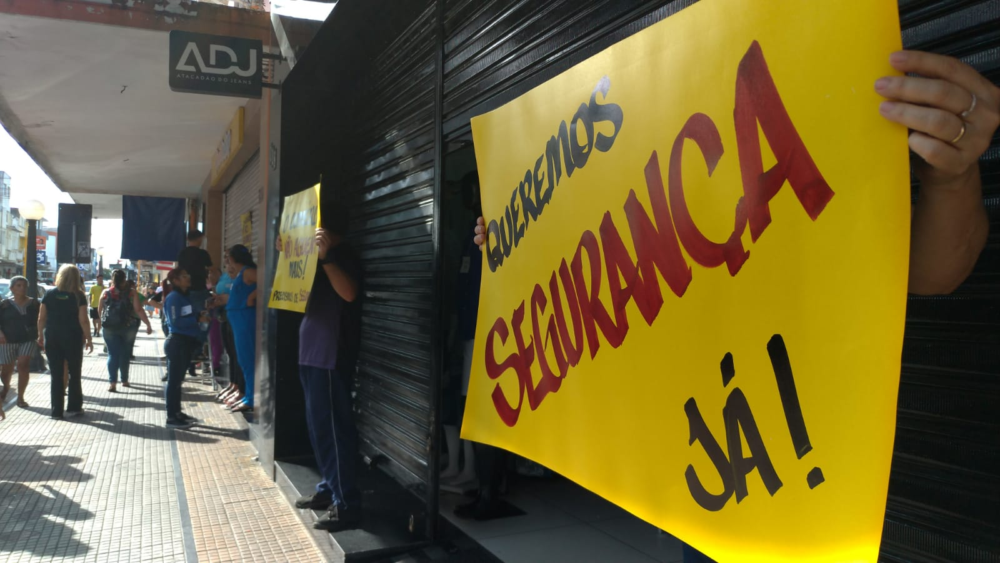
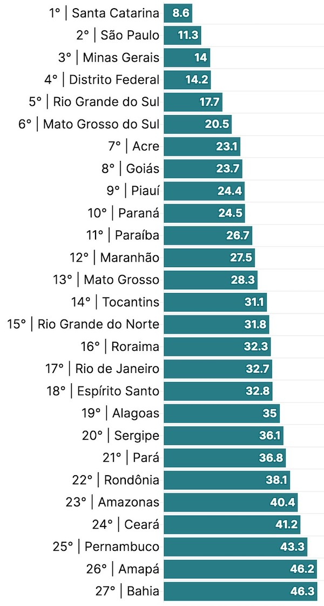
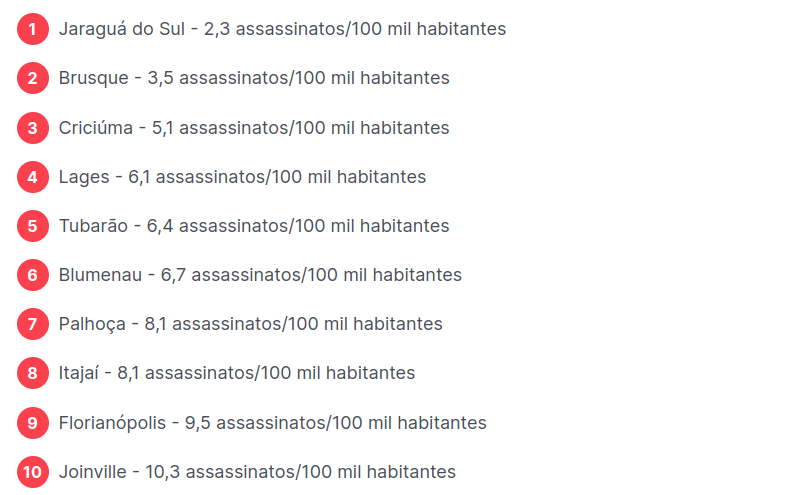
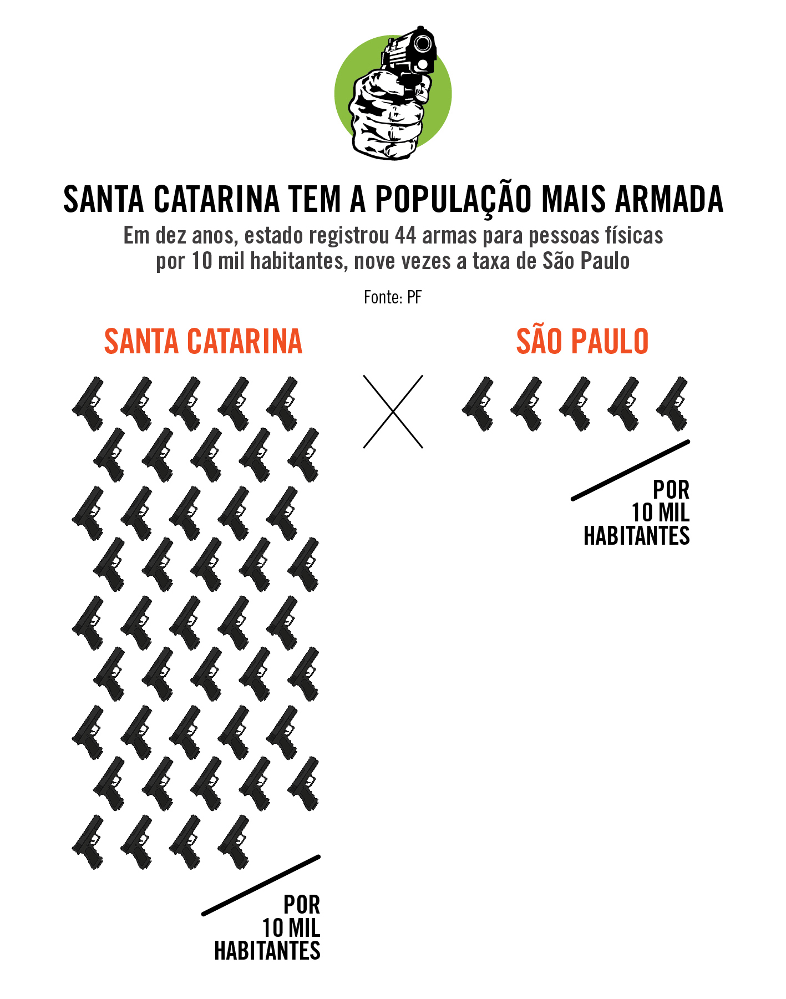

```
Revisado por: Cypherpunks Brasil
```
[```ver lista de contribuidores```](/about/#contribuidores)

# Sem segurança não há economia



## Introdução

Já imaginou sair de seu trabalho e no outro dia os produtos não estarem mais lá? Essa é a realidade de muitas pessoas e também um medo diário de todo comerciante.

Muitos defensores do meio econômico entonam seu argumento para apenas reformas e mudanças no mercado, assim esquecem anteriormente da segurança e acabam errando ao propor melhorias, que sejam de pensamento progressista, liberal, libertário, autoritário, conservador e assim por diante. Nesse pequeno ensaio escrevi especificamente sobre o Brasil e Santa Catarina, porém muitos pontos você pode comparar com locais no seu raio de vida.

As trocas e compras realmente melhoram a vida das pessoas, mas mesmo sendo uma economia muito ou pouco controlada pelo estado, se não houver seguridade, as pessoas não irão querer cooperar umas com as outras. 

[Em Campina Grande (Paraíba) os comerciantes já chegaram a fechar suas portas](https://www.horaagora.com.br/2023/04/comercio-de-campina-grande-fecha-as.html) para pedir mais segurança para os trabalhadores e clientes. A segurança é um elemento anterior e fundamental para a base de qualquer sociedade, como não podemos construir um computador sem componentes eletrônicos, não conseguimos ter uma economia saudável sem segurança.

## Prosperidade de um local

Antes de planejar estratégias de negócios, precisamos estar vivos, ou seja, a segurança é mais importante que o mercado! Nos grupos mais primitivos não há mercado, mas há uma forma de se manter seguro e vivo. O medo muitas vezes pode ser pior que a própria morte, vemos muitas pessoas com diversos traumas após sofrerem algum tipo de agressão ao seu corpo ou propriedade.

Diversas empresas fecham as portas porque estão sendo assaltadas, os trabalhadores querem segurança! O estado de Santa Catarina é um dos que mais cresce em população e economicamente, seu território não é tão grande em comparação a outros estados brasileiros, mas mesmo assim mantém uma ótima segurança. Essa UF consegue suportar boa qualidade de vida, belas praias, empregos e bom nível de educação. É o estado mais seguro do país, abaixo é exibida a [quantidade de assassinatos por 100 mil habitantes em cidades superiores ou igual a esse número em 2023](https://myside.com.br/guia-imoveis/estados-mais-seguros-brasil):



Nessa próxima imagem é mostrado o _ranking_ de segurança das cidades de Santa Catarina com 100 mil habitantes ou mais em 2023:



A maioria dessas cidades com pequena quantidade de homicídios estão localizadas no Vale do Itajaí ou próximas dele, muitas cidades do Vale Europeu tem menos de 100 mil habitantes e não estão dentro desse _ranking_, algumas delas passam em branco, outras com somente 1 ou 2 assassinatos por ano. Isso aumenta o incentivo a moradia e abertura de negócios, o que mostra mais um ponto da prosperidade dessa localidade.

## As pessoas querem trabalhar

No ano de 2015 os [moradores de Araguaína (Tocantins) protestaram pedindo por segurança](https://henriqueaires.wordpress.com/2015/06/11/para-pedir-seguranca-empresarios-vao-fechar-o-comercio-de-araguaina-e-interditar-a-br-153-na-proxima-4a) por causa dos níveis de assaltos a casas e comércios.

Em grande parte, os lugares aonde há mais segurança, as pessoas são mais ricas e a desigualdade é menor, lugares aonde a criminalidade domina, apenas as elites podem ter uma vida em paz, pois ficam fechadas em seus quadrados.

O estado do Brasil mais armado por quantidade de habitantes é Santa Catarina, abaixo temos uma imagem com dados de 10 anos sobre [registros de armas de nove vezes mais em Santa Catarina do que em São Paulo](https://piaui.folha.uol.com.br/o-brasil-se-arma):



Criminosos gostam de andar armados, mas temem quem também anda. O desarmamento é um incentivo a criminalidade, pois cria coragem e da abertura a bandidos cometerem crimes. Um tiro disparado por um mau elemento pode ser combatido apenas por um tiro disparado por um bom elemento. Ou seja, antes de uma pessoa cometer um delito, ela pensará sobre como está a situação de segurança do local e dos indivíduos a sua volta.

Mesmo o unionismo brasileiro sugando diversas partes do território, Santa Catarina ainda resiste na tentação do crime. O separatismo cada vez vem ganhando mais adeptos quando a população decide estudar sobre as raízes dos problemas.

## Conclusão

Equipamentos como câmeras são fundamentais em locais perigosos, meios de pagamentos confiáveis também trazem mais garantia para ambos os lados. Não podemos deixar de falar da vantagem em números que uma pessoa tem de salvar sua vida e comércio na posse de uma arma.

Infelizmente o Brasil é um país extremamente contraditório nas questões de justiça e leis. O governo com seu monopólio da força se propõe a garantir o direito de _"ir e vir"_, mas devido em grande parte a ineficiência da estrutura policial, que muitas vezes agride o próprio comerciante ou _"enxuga gelo"_. 

Em muitos lugares onde a cultura não respeita a propriedade do outro, a agressão as pessoas se torna maior. A individualidade de cada um é única e deve ser respeitada, nunca coletivizada e passada por cima. Até falando da não segurança jurídica ao copiar e reusar algum conteúdo, a propriedade intelectual não é tema para esse texto, mas ela é antiética e garante seguridade aos grandes monopólios de patentes, principalmente as indústrias farmacêuticas que se aliam e fazem _lobby_ com o estado, essa junção ceifa vidas, você deve ser punido somente se danifica a propriedade de alguém, copiando você apenas reutiliza a ideia que não é escassa, como copiar um CD não danifica sua origem, diferente de quebrar um carro, assim você esta danificando a origem. Não se tem como exercer sua liberdade se alguém lhe impede de fazer algo lícito, como trabalhar.

Esse papo _"juridiquês"_ contribui para o atraso do país, tudo é relativo para a lei, meramente interpretativo e parcial para um jurista, não é como um algoritmo de computador que é 0 ou 1. Quem sabe um dia teremos uma justiça exata. As decisões são tratadas por diversas pessoas com educações, lares, culturas e conhecimentos diferentes, assim que acontecem as injustiças e dão a segurança jurídica para marginais cometerem crimes, pois sabem que terá um aparelho para protegê-lo. Uma monarquia se prova mais eficaz e produtiva, pois não se tem essa falsa pluralidade de decisões, como vimos na história os monarcas e as pessoas de sua confiança aplicavam duras penas para criminosos, o que ajudou nos pequenos números de crimes em sociedades antigas até a ascensão da democracia que conhecemos, obviamente ocorreram injustiças, mas nada se compara nos dias atuais.
