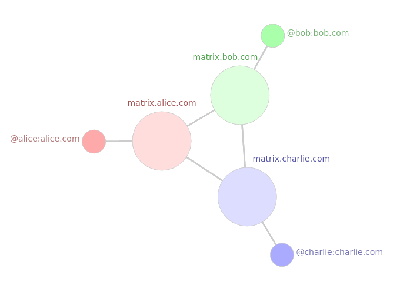

```
Escrito por: Matheus Bach
```

[```ver lista de contribuidores```](/about/#contribuidores)

# Tutorial de uso do ```[ Matrix ]```

## O que é Matrix?

*"Você quer saber o que é Matrix?" ~Morpheus*. (não é disso que vamos falar)

[Matrix](https://matrix.org/) é mais que um protocolo de mensagens, ele fornece toda uma solução para comunicações de forma realmente distribuída. Matrix é uma rede aberta para comunicação segura e descentralizada

Quando você envia uma mensagem no Matrix, ela é replicada em todos os servidores cujos usuários estão participando de uma determinada conversa. Não há um ponto central de controle ou falha em uma conversa Matrix que abrange vários servidores: quando você se comunica com alguém em um servidor, essa conversa é replicada e mesmo que o seu servidor fique offline depois, o outro servidor que recebeu a mensagem poderá replicar ela.



Isso significa que cada servidor tem total auto-soberania sobre os dados de seus usuários - e qualquer um pode escolher ou executar seu próprio servidor e participar da rede Matrix. É assim que a Matrix liberta o controle sobre a comunicação.

Por padrão, o Matrix usa APIs [HTTPS+JSON](https://matrix.org/docs/spec/client_server/latest.html#api-standards) simples como linha-base para a transmissão de dados, mas também abrange transportes mais sofisticados, como [WebSockets](https://github.com/matrix-org/matrix-doc/blob/master/attic/drafts/websockets.rst) ou [ultra-low-bandwidth Matrix](https://matrix.org/blog/2019/03/12/breaking-the-100-bps-barrier-with-matrix-meshsim-coap-proxy)  via CoAP+Noise.

Matrix é um padrão aberto, com código fonte também aberto (https://github.com/matrix-org/). Além de enviar mensagens, ele suporta também criptografia de ponta a ponta (igual a do Signal), VoIP, Bridging (pontes), etc. e os clients de signal conseguem construir em cima disso várias outras coisas como por exemplo: chamadas de vídeo, status, canais, reações e várias outras coisas presentes nos apps de comunicação populares


## Como usar o Matrix na prática 📩

### 1. Escolha um Client
Para conectar na rede federada Matrix, você precisa de um "client", ou seja, de um software que execute o protocolo Matrix. Há uma grande diversidade de "clients" para você escolher. 

Escolha um em https://matrix.org/clients/. Particularmente, estou gostando do [Element](https://element.io/). O canal no Telegram @chatdeguerra fez um [Tutorial de como usar o FluffyChat](https://t.me/chatdeguerra/79)

### 2. Crie uma conta
Essa etapa é bastante delicada. A forma como você criará sua conta corresponde ao quão privado você pretende ser

Para registro e acesso mais privativos, prefira utilizar TOR ou VPN, pois esconderão seu ip desde a criação e também em todas as suas interações.

Você pode simplesmente usar o Element e fazer login com uma conta Google, mas aí já é de fude viu. Você também pode usar a opção que geralmente vem por padrão nos apps, que é se registrar no servidor oficial do Matrix (```matrix.org```). Essa opção é a mais usada, mas você precisa colocar e-mail para se registrar. Eles dizem que é só pra recuperar a senha e evitar bots, acredita nisso quem quer. De qualquer forma, para conversar em grupos abertos sem nada de tão sigiloso isso já é bom o bastante

Na hora de registrar seu usuário, você pode encontrar uma opção para alterar o servidor. Dessa forma, pode criar seu nick através de outros servidores que não obrigam usar e-mail no cadastro, como por exemplo o ```monero.social```.

É preferível que usuários estejam conectados a partir de diversos servidores, pois isso ajuda a distribuir mais a comunicação

A opção mais privada e que ajuda a descentralizar a transmissão e armazenamento de mensagens é sem dúvidas hospedar seu próprio servidor Matrix. 
Tutoriais em inglês de como fazer seu host usando [Synapse](https://github.com/matrix-org/synapse):
- https://theselfhostingblog.com/posts/self-hosting-your-own-matrix-server-on-a-raspberry-pi/
- https://github.com/matrix-org/synapse/blob/master/README.rst

### 3. Faça login
Bem, você criou uma conta, faça login nela

### 4. Explore
Você está na Matrix
Como sugestões de grupos, vou deixar alguns links no Matrix:

- Cypherpunks Brasil (oficial): https://matrix.to/#/#cypherpunksbrasil:matrix.org

- Cypherpunks Brasil (não sei quem fez esse grupo e usou o nome do projeto, mas ta valendo): https://matrix.to/#/!oHBPdQselcPfaJBjrG:privacytools.io

- Matrix Memes: https://matrix.to/#/!zjksQKLqdmsBkxQDQO:matrix.org

- Ucrânia em Chamas: https://matrix.to/#/!XAGFbIkfyRKAtTybms:poa.st

- Cute Aminals: https://matrix.to/#/!QIdoWeIDpboNLPkKgO:matrix.org

### Então Matrix é perfeito?
Em tudo há tradeoffs. Nesse caso você abre mão da facilidade de um app muito usado como Telegram e WhatsApp para ir para um app com menos contatos (talvez os que valem a pena)
Matrix também não é a solução mais privada que existe. XMPP por exemplo ganha nesse quesito como explicado em https://lukesmith.xyz/articles/matrix-vs-xmpp. Porém, para grupos abertos e chat no geral, Matrix parece ser a melhor opção para tornar a comunicação resistente a censura.

Compartilhe esse post para pessoas que possam ter interesse, é um favor que você faz a elas