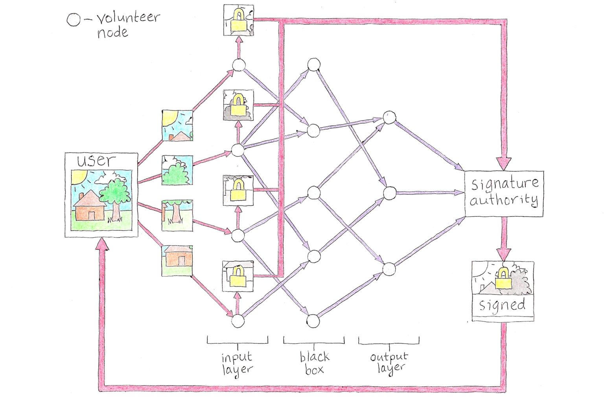

```
Tradução por: mem3tic@mut8ion
Formatação e revisão: Vinicius Yaunner
```
[```ver lista de contribuidores```](/about/#contribuidores)

# ZKANN: Uma Possível Solução para o Problema de Conteúdos Nocivos

Eu li [este](https://techcrunch.com/2018/12/20/whatsapp-pornography/) artigo recentemente, e tenho uma ideia de como resolver o problema que apresenta. O artigo é sobre como o WhatsApp e outras plataformas com criptografia ponta-a-ponta estão sendo usadas para espalhar pedofilia. A criptografia ponta-a-ponta é essencial para a privacidade online. Sem isso, os provedores de serviços são capazes de escutar suas comunicações, ver suas fotos e juntar suas peças toda a sua vida. Isso pode ser bom se você puder confiar neles para manter suas informações privadas, mas eles não vão. Eles as usam para categorizá-lo, rastreá-lo e vendê-lo a anunciantes ou entregá-lo ao Big Brother.

No entanto, como o artigo aponta, algumas pessoas estão abusando dessa privacidade. Quando seu conteúdo é criptografado, não há como distingui-lo de todo o outro conteúdo criptografado que flui através do sistema. Se algo não for feito sobre isso, podemos perder essa importante ferramenta de aprimoramento de nossa privacidade em nome de ir atrás desses maus atores. O que precisamos é de uma maneira de separar o conteúdo nocivo do resto sem realmente ver nenhum deles! Eu chamo isso de “problema do conteúdo”. Logo de cara, isso parece ser uma tarefa impossível. No entanto, através de uma combinação de criptografia e inteligência artificial, pode haver um caminho.

## Entre na ZKANN

As plataformas já lidam com o problema do conteúdo. Seus usuários criam muito conteúdo para sua equipe olhar e ler tudo o que é postado. Então, eles usam algoritmos para filtrar e categorizar o conteúdo para que o conteúdo prejudicial seja sinalizado ou removido automaticamente. Um algoritmo que eles usam é chamado de “rede neural artificial” (artificial neural network, ANN, em inglês). redes neurais artificiais estão no centro do aprendizado de máquina e grande parte dos recentes avanços em IA.

As redes neurais artificiais são inspiradas na forma como os cérebros funcionam. Eles são compostos de um monte de neurônios simulados conectados uns aos outros em uma rede. Cada neurônio é muito simples. Ele dispara um sinal a jusante (downstream, descentende) para os neurônios aos quais está conectado, somente se seus neurônios a montante (upstream, ascendentes) dispararem com força suficiente para ele. Como esses neurônios estão conectados – a topologia da rede – é o que dá origem à complexidade da rede neural artificial e permite que ela execute tarefas sobre-humanas, como filtrar rapidamente através de montanhas de conteúdo do usuário.

A topologia é criada alimentando muito conteúdo na RNA (rede neural artificial), recompensando-a quando identifica corretamente um conteúdo e punindo-o quando erra. A recompensa fortalece as conexões neurais que levaram a um resultado correto, enquanto a punição enfraquece as conexões que levaram a um resultado incorreto. Depois de muitas rodadas de tentativa e erro em um processo chamado “treinamento”, a RNA pode identificar corretamente novos conteúdos. Ele “aprendeu” o que deve e não deve passar pelo seu filtro.

É importante notar que a topologia da RNA é basicamente uma caixa preta. Assim como não podemos ler os pensamentos de uma pessoa olhando para um escaneamento do cérebro, não sabemos como as RNAs tomam as decisões que tomam. Isso já foi citado como um problema antes. E se, por exemplo, uma RNA fosse treinada em um conjunto de dados contendo um viés racial desconhecido? Poderia então tomar decisões racistas e não saberíamos disso. No entanto, podemos usar essa incapacidade de examinar o funcionamento interno das RNAs a nosso favor enquanto resolvemos o problema do conteúdo.

A solução que proponho envolve uma RNA quase descentralizada e que usa criptografia para garantir que nenhum nó (nodes) único possa ver mais do que um pequeno pedaço do conteúdo sendo examinado. Essa peça é muito pequena para o nó ter ideia do que é o conteúdo, mas como um todo a rede pode classificá-la. Eu chamo essa construção de “rede neural artificial de conhecimento zero” (Zero Znowledge ANN, em inglês), ou ZKANN (pronuncia-se zee-can).

Começa por treinar uma RNA à moda antiga: alimentando muito conteúdo em uma nova RNA até que possa diferenciar entre conteúdo prejudicial e normal. Pode ser frutífero fazer parceria nesta tarefa com as agências de aplicação da lei que apreenderam e protegeram esse conteúdo durante as investigações. Felizmente, ninguém precisa visualizar o conteúdo à medida que ele é alimentado através da RNA, e o processo pode ser realizado em uma instalação segura. Uma grande variedade de conteúdo normal também deve ser usada para treinamento, de modo a minimizar falsos positivos. Uma vez que a RNA é treinada, é liberada para o público para que possa ser usada como base para ZKANNs.



Como visto na imagem acima, existem três tipos de participantes em um ZKANN: o usuário, nós  voluntários e a autoridade de assinatura (SA). Os nós voluntários são operados por voluntários independentes que desejam contribuir com seus recursos computacionais ociosos para identificar conteúdo nocivo online, e as autoridades de assinatura são partes amplamente confiáveis que assinam conteúdo considerado “não prejudicial” pela ZKANN. Primeiro, analisaremos o caso em que todos os três participantes estão cooperando e desempenhando seu papel como pretendido. Então, vamos olhar para os cenários onde eles podem se desviar e tentar jogar com o sistema.

O processo começa com o usuário selecionando uma SA e uma RNA pública. A SA responde que está pronta e os operadores de nó começam a se voluntariar para participar. Cada um desempenhará o papel de um neurônio artificial na RNA em questão.

Cada RNA tem o que é conhecido como “camada de entrada”. Os nós na camada de entrada aceitam como entrada um pequeno pedaço do conteúdo que está sendo analisado. Por exemplo, cada nó na camada de entrada poderia aceitar um número que representa a cor de um pixel individual de uma imagem. Se a imagem for composta de 100 pixels, haveria 100 nós de camada de entrada, um para cada pixel.

Os nós voluntários em nossa ZKANN que acabam na camada de entrada agora receberão do usuário um pequeno pedaço do conteúdo que está sendo analisado. Na imagem, o conteúdo (uma imagem de uma casa) é dividido em apenas quatro pedaços. Na prática, haveria muitos mais [pedaços] e muitos mais nós voluntários em geral. Como cada nó é operado de forma independente, nenhum tem acesso a mais do que um pequeno pedaço do conteúdo e, portanto, não pode determinar qual é o conteúdo.

Agora, nossos nós na camada de entrada realizarão duas operações importantes. Primeiro, eles enviarão um sinal para seus operadores de nó a jusante (downstream, descendentes) de acordo com a topologia da RNA pública que está sendo usada (setas roxas). Este sinal carrega algumas informações sobre o pequeno conteúdo em que é baseado, mas não o suficiente para o nó a jusante (downstream, descendente) determinar qual é o conteúdo original. Em segundo lugar, os nós da camada de entrada encriptarão sua pequena parte do conteúdo com a(s) chave(s) usada(s) no esquema de criptografia de ponta a ponta e enviá-lo para a SA (setas vermelhas). Uma vez que o SA tem todas as peças encriptar separadamente, ele as agrupa e aguarda o sinal final da camada de saída.

A camada de saída é o último conjunto de nós no ZKANN. Eles enviam seus sinais a jusante para a SA que usa esses sinais para fazer a determinação final se o conteúdo original é prejudicial ou não. Como a RNA opera como uma caixa preta, não há como a SA - ou qualquer um dos nós - fazer o caminho contrário independentemente para obter o conteúdo original. Mas, milagrosamente, a SA pode dizer se o conteúdo é ou não prejudicial com base em seus sinais recebidos. Se, com base neles, os dados forem considerados “não prejudiciais”, ele sinaliza criptograficamente o pacote criptografado de conteúdo e os envia de volta ao usuário.

Agora, sem nunca ter revelado mais do que um pequeno pedaço do conteúdo para cada participante, o usuário pode mostrar aos provedores de serviços que o conteúdo não é prejudicial e eles podem servir esse usuário com a consciência limpa.

## Desenvolvimento Futuro

Como prisioneiro, não posso construir protótipos, pesquisar ou desenvolver ZKANNs, e há algumas áreas que precisam de trabalho. Se você notou, eu fiz questão de deixar claro que os operadores de nós devem ser independentes. A construção da ZKANN só funciona como pretendido se nenhum participante controlar mais do que uma pequena fração dos nós voluntários que estão sendo usados. Se alguém que não fosse o usuário controlasse todos os nós da camada de entrada, por exemplo, eles poderiam juntar os fragmentos do conteúdo e a privacidade do usuário seria perdida. Por outro lado, um usuário mal-intencionado que controla uma grande fração dos nós voluntários poderia enviar sinais correspondentes ao conteúdo normal, mesmo que o conteúdo original fosse prejudicial e enganasse uma SA para assinar conteúdo prejudicial.

Ao meu ver, um serviço como o WhatsApp poderia contar com a ajuda de um punhado de organizações independentes que querem contribuir para combater conteúdo nocivo online (por exemplo, Wikimedia, EFF, etc.) para atuar como SAs. Os usuários podem selecionar os que desejam usar ou apenas serem escolhidos aleatoriamente. Então, a SA seria responsável por selecionar nós independentes. Isso exigiria um grau de confiança por parte do usuário, mas os usuários do WhatsApp já confiam na plataforma para criptografar seu conteúdo em primeiro lugar. Talvez alguém possa encontrar uma forma de garantir a independência do nó em uma versão totalmente descentralizada de ZKANNs que não requer confiança.

Se resolvermos esses problemas (e outros, que certamente passaram despercebidos), teremos uma ferramenta poderosa para combater conteúdo nocivo online sem violar a privacidade das pessoas. Eu comentei a ideia com alguns especialistas, e eles acreditam que é novo e promissor, mas eu não posso fazer muito mais com isso da prisão. Espero que alguém lá fora se interesse e corra com isso.

O que os ZKANN tornam possível é a censura sem a perda de privacidade. Tanto a censura quanto a privacidade são problemáticas se não forem controladas, mas os ZKANNs colocam um contra o outro, atingindo um equilíbrio que nos dá o melhor dos dois mundos. Censura sem privacidade pode levar à perda da liberdade de expressão e à dissidência civilizada. Por outro lado, como vimos, a privacidade sem censura pode levar à proliferação de conteúdos nocivos.

Sem uma solução técnica, o debate sobre privacidade e criptografia continuará, com ambos os lados assumindo posições cada vez mais polarizadas e extremas. Os defensores da privacidade têm que ignorar o problema do conteúdo ou racionalizar que é apenas um efeito colateral inevitável, superado pelo bem maior da privacidade. Aqueles do outro lado dizem que a perda de privacidade é um pequeno preço a pagar para policiar o conteúdo, ou que apenas os criminosos querem privacidade. Ou será que só os tiranos querem um mundo sem ela?

Se os ZKANNs puderem ser implantados com sucesso, ambos os lados podem ter seu próprio bolo e comê-lo também. Os argumentos extremos anti e pró-privacidade tornam-se discutíveis. Vamos parar de lutar e abrir um ZKANN.

---
Fonte: https://freeross.org/zkann/
