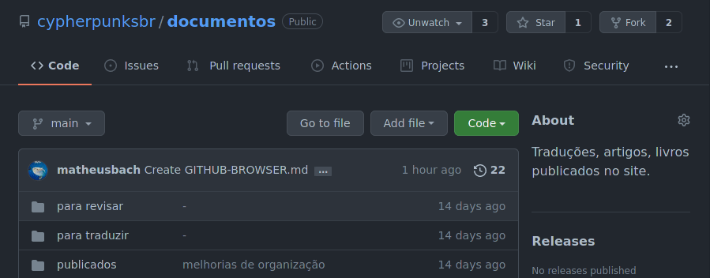

# Tutorial de uso do GitHub via website 

> rodando no navegador e aplicado ao caso de uso do nosso repositório

> Trechos deste tutorial foram extraídos de docs.github.com

**Nesse tutorial serão apresentadas algumas operações básicas de github pelo navegador**

---

## Criando um fork

- Dentro do repositório que você quer criar um fork, no canto superior direito clique em ```fork```;



- Feito isso o fork será criado e você será redirecionado para a página do seu fork.
  
---

## Criando uma nova Branch

- Dentro do repositório que você quer criar a branch (pode ser dentro de seu fork), clique no botão inde são exibidas as branchs;
- Digite um nome para sua nova branch e em seguida clique em ```criar branch: nome-da-branch```


- Quando quiser navegar novamente para essa branch já criada, basta fazer isso clicando no botão de branch e selecionando ela na lista.

---

## Renomeando e movendo arquivos

- Navegue até o arquivo que deseja mover;
- No canto superior direito da exibição do arquivo, clique no lápis para abrir o editor de arquivos;
- Para alterar o nome do arquivo basta ir na barra superior e editar o nome;


- Para mover o arquivo para uma subpasta, digite o nome da pasta desejada, seguido por ```/```. Sua nova pasta é um novo item na navegação estrutural.
- Para mover o arquivo para um diretório acima da localização atual do arquivo, coloque o cursor no início do campo nome do arquivo e digite ```../``` para pular um nível de diretório inteiro ou pressione a tecla backspace para editar o nome da pasta principal.